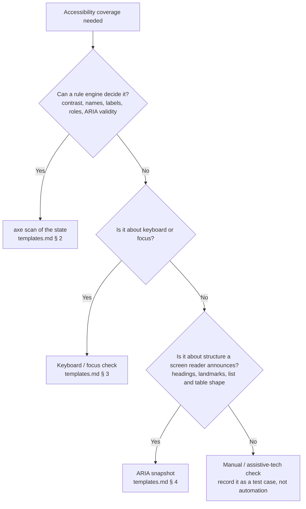

# Accessibility Testing

Automated accessibility checks for Playwright suites, built on `@axe-core/playwright`. It covers **what** to scan (every meaningful state, not just page load), **how** to assert (strictly, with the full result attached), **what automation cannot see** (keyboard, focus, structure, meaning), and **how to live with known violations** without hiding new ones.

The failure mode this prevents: an a11y suite that is green because it scanned a loading skeleton, disabled the rules that failed, or stopped at the first page — while keyboard and screen-reader users are blocked on the real flow.

**Evidence: STATIC.** The patterns follow Playwright's accessibility-testing guide and the `@axe-core/playwright` API. They have not been executed against an app from this repository; record the first real run in `memories/learned_patterns.md`.

This skill has no paired rule (rule disposition: skill-only).

## Critical

- **ALWAYS** get the axe builder from a fixture (`makeAxeBuilder`), never `new AxeBuilder({ page })` inside a spec. The fixture fixes the WCAG tags and the documented exclusions in one place, the same reason page objects come from fixtures (the `fixtures` skill). Skeleton: [templates.md § 1](templates.md).
- **ALWAYS** wait for the state you mean to scan before calling `analyze()` — a web-first assertion on the content (`await expect(page.getByRole('heading', { name })).toBeVisible()`). Scanning before the data loads audits the skeleton and passes falsely.
- **ALWAYS** assert strictly: `expect(results.violations).toEqual([])`, and attach the full results to the report. A count assertion (`toBeLessThan(5)`) lets new violations in silently; the attachment is what makes a red run actionable.
- **NEVER** call `disableRules(...)` or drop a WCAG tag to make a scan pass. That is the accessibility version of loosening a schema. A real known violation goes in the known-violations list with a ticket and an expiry (§ Known violations) — never in a spec-local disable.
- **ALWAYS** scan every meaningful state, not just the first render: dialogs open, form validation errors shown, empty state, error state, expanded menus. These are exactly the states `web-testability.md` requires the product to make addressable — and where most real a11y defects live.
- **NEVER** treat a clean axe scan as "accessible". Automated rules can check only part of WCAG. Pair scans with keyboard and focus checks (Tab order, focus trap in dialogs, Escape returns focus to the trigger) and ARIA structure assertions (§ Beyond the scan).
- **ALWAYS** report a missing accessible name or label as a **product** defect (via `bug-helper`), never route around it with a test-id. A role locator that cannot find a control is the test doing its job.
- **ALWAYS** follow the framework rules for the spec itself: fixtures barrel import, exactly one tag from the `test-standards` whitelist (do not invent `@a11y`), `qase.suite(...)` first, `test.step` phases, WCAG tag list from a constant — not inline.

## What's in each file (read this before reaching for another file)

| File | Purpose | Read when |
|------|---------|-----------|
| **`SKILL.md`** (this file) | Rules, scan strategy, known-violations policy, anti-patterns. | Any accessibility test work. |
| **[`templates.md`](templates.md)** | Copy-paste skeletons: the `makeAxeBuilder` fixture, a page-state scan spec, keyboard / focus checks, ARIA snapshot. | Scaffolding a new a11y spec or fixture. |

**Boundary rule:** decisions and rules live here; code skeletons live in `templates.md`. No code block longer than ~5 lines in this file.

## Decision tree — what kind of check

## Scan strategy

**Which tags.** Scan against the project's target conformance level, normally WCAG 2.x A + AA: `wcag2a`, `wcag2aa`, `wcag21a`, `wcag21aa`, `wcag22aa`. The list lives in one constant (the `enums` skill) and the fixture reads it. Raising the level is a deliberate decision recorded in that constant, not a per-spec choice.

**Which states.** For each page or feature under test, list its meaningful states and scan each one: initial content, each dialog or drawer open, the form with validation errors visible, empty and error states, any expanded menu or disclosure. Use the page object's action methods to reach each state — they already wait for the result (the `page-objects` skill).

**Scope.** Scan the whole page by default. Use `include(...)` to focus a component test on the component; use `exclude(...)` only for regions you do not own (third-party widgets), each with a comment naming the owner. Exclusions live in the fixture, never scattered across specs.

**Where the spec lives.** Follow `test-standards` placement. The default is one `<feature>-accessibility.spec.ts` per feature, so a11y failures report separately from functional ones while reusing the same page objects.

## Known violations

Some violations will be real, known and not fixable this sprint. They must not block every run, and they must not hide new ones.

- Keep **one** known-violations list (next to the fixture), each entry with the axe rule id, the affected selector or component, a **ticket**, and an **expiry date**.
- The fixture applies the list as targeted `exclude(...)` for that component only — never a global `disableRules`. New violations of the same rule elsewhere still fail.
- An expired entry fails the run until it is renewed with a reason or removed. This is the same quarantine-with-expiry policy as `flakiness-triage`: an exception nobody revisits becomes permanent.

## Beyond the scan

Automation catches missing names, labels, roles and contrast. It cannot judge whether the experience works. Three cheap Playwright checks cover the most common gaps:

- **Keyboard path.** The primary flow can be completed with `Tab`, `Shift+Tab`, `Enter`, `Space` and `Escape` alone; assert focus with `await expect(locator).toBeFocused()`.
- **Dialog focus.** Opening a dialog moves focus into it, Tab stays inside, and `Escape` closes it and returns focus to the trigger.
- **Structure.** `toMatchAriaSnapshot` pins the headings, landmarks and list or table shape a screen reader announces. Keep the snapshot small and about structure, not copy.

Everything else (meaningful alt text, sensible reading order, error messages that make sense when read aloud) is a manual check. Record it as a test case so it is visible, not as automation that pretends to cover it.

## Anti-patterns

- ❌ **Scanning on `page.goto` and nothing else.** Misses every state where defects live. Fix: one scan per meaningful state.
- ❌ **`disableRules(['color-contrast'])` in a spec to get green.** Hides every future contrast regression too. Fix: a known-violations entry, scoped, with ticket and expiry.
- ❌ **`expect(results.violations.length).toBeLessThan(N)`.** Lets new violations in while the count stays under N. Fix: `toEqual([])` plus a known-violations list.
- ❌ **`new AxeBuilder({ page })` in every spec.** Tags and exclusions drift per file. Fix: the `makeAxeBuilder` fixture.
- ❌ **Injecting axe by hand with `page.evaluate`.** Forbidden by the constitution and unnecessary — `AxeBuilder` injects itself.
- ❌ **A new `@a11y` or `@accessibility` tag.** Not in the whitelist, so no CI job runs it. Fix: a whitelisted tag from `test-standards`.
- ❌ **Switching to `getByTestId` because `getByRole` cannot find a control.** That is an accessibility defect being routed around. Fix: file it, keep the role locator.
- ❌ **Calling a clean scan "WCAG compliant" in a report.** Overclaims what automation covers. Fix: report "no automated violations at <level>" and list the manual checks separately.

## Self-review checklist

- [ ] Axe builder comes from the `makeAxeBuilder` fixture; WCAG tags come from one constant.
- [ ] Every scan is preceded by a web-first assertion that the intended state is on screen.
- [ ] Every meaningful state of the feature is scanned (dialogs, validation errors, empty / error states).
- [ ] Assertion is `expect(results.violations).toEqual([])`, and results are attached to the report.
- [ ] No `disableRules`, no dropped tags, no spec-local exclusions; known violations are in the one list with ticket + expiry.
- [ ] Keyboard path and dialog focus are checked for the primary flow.
- [ ] Missing names / labels found along the way were filed as product defects, not worked around.
- [ ] Spec follows `test-standards`: barrel import, one whitelisted tag, `qase.suite` first, `test.step` phases.
- [ ] Ran the spec; results attached; first real run recorded in `memories/learned_patterns.md`.

## Examples

### Example 1 — "Add accessibility coverage for the settings page"

1. **List the states.** Initial content, the "delete account" confirmation dialog, the profile form with validation errors shown.
2. **Fixture.** Confirm `makeAxeBuilder` exists in the fixtures barrel; add it from [templates.md § 1](templates.md) if not.
3. **Spec.** `settings-accessibility.spec.ts`, one test per state. Each test reaches its state through the `SettingsPage` action methods, asserts the state is visible, scans, attaches, asserts `toEqual([])` ([templates.md § 2](templates.md)).
4. **Beyond the scan.** Add a keyboard test: Tab to Save, press Enter, success toast shown; open the dialog, Escape, focus back on the trigger ([templates.md § 3](templates.md)).
5. **Run.** Two contrast violations appear on a third-party chat widget: exclude that widget in the fixture with its owner named. One missing label on the avatar upload: file it via `bug-helper`, and the scan stays red until it is fixed or entered as a known violation with a ticket and expiry.

### Example 2 — "The scan fails on color-contrast in the footer; just disable it"

Refuse the global disable. Check whether the footer is owned by this team. If it is, file the defect and add one known-violations entry scoped to the footer, with ticket and expiry — new contrast failures anywhere else still fail. If it is a third-party embed, exclude that region in the fixture with the owner named. Either way the rule stays on.

## Troubleshooting

| Symptom | Cause | Fix |
|---|---|---|
| Scan passes but the page is visibly broken for keyboard users | Automated rules cannot judge interaction | Add the keyboard / focus checks (§ Beyond the scan) |
| Scan passes locally, fails in CI on contrast or `region` | Scanned before content or fonts loaded; theme differs | Assert the intended content is visible first; pin the theme / color scheme in config |
| Same violation reported many times | One defect in a repeated component | Fix once in the component; the known-violations entry targets the component selector |
| `analyze()` reports violations inside an iframe you don't own | Third-party embed | Exclude the iframe in the fixture with the owner named |
| Results hard to read in a red run | Only the assertion diff is shown | Attach the full JSON results (`testInfo.attach`) — templates.md § 2 does this |
| Expired known-violations entry fails the run | Nobody revisited the exception | Fix the defect, or renew the entry with a reason and a new date |

## See Also

- **`selectors`** — role-first locators double as accessibility checks; a failing `getByRole` is often an a11y defect.
- **`page-objects`** — action methods that reach each state and wait for it.
- **`fixtures`** — how `makeAxeBuilder` is registered and merged into the barrel.
- **`test-standards`** — spec placement, the tag whitelist, Qase wiring.
- **`enums`** — where the WCAG tag constant lives.
- **`flakiness-triage`** — the quarantine-with-expiry policy the known-violations list mirrors.
- **`bug-helper`** command — filing what a scan finds.
- **`constitutions/web-testability.md`** — the product-side markup rules (semantic HTML, labels, `aria-label`, dialog roles) that make these scans pass.
- **`owasp-security-testing`** — the other non-functional skill; same "gate that can fail" discipline.
