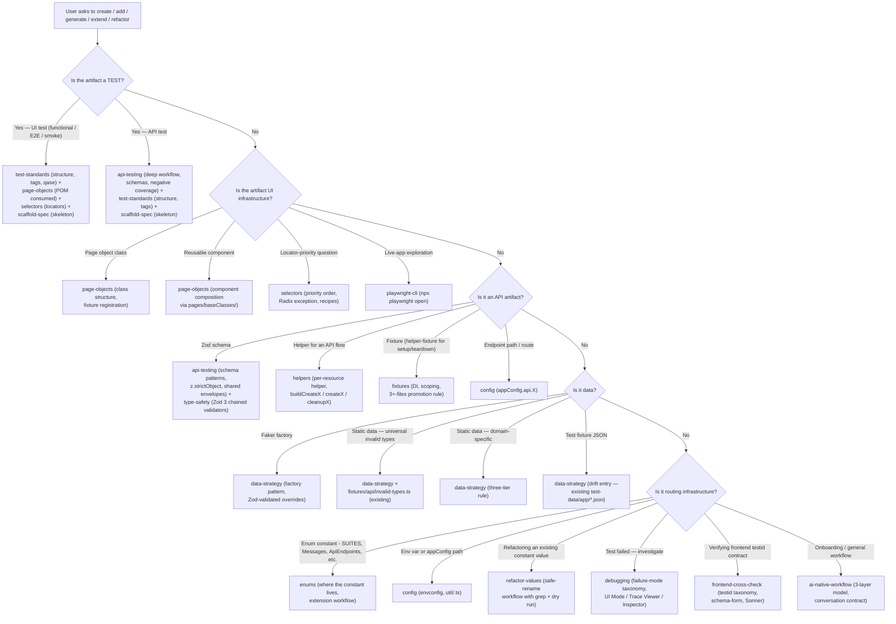

# Common Tasks (Routing Layer)

This skill is the front door when a user request doesn't name a specific area. It answers two questions: **(1) which deep skill owns this work?** and **(2) what framework-wide rules must every artifact obey, regardless of skill?** It does **not** teach the deep rules of any one area — those live in the specialized skills it routes to. This is a routing layer; the substance lives downstream.

The orchestrator at [~/.claude/CLAUDE.md](~/.claude/CLAUDE.md) holds the global Routed Detail Index and the framework's MUST / WON'T tables. **Read it first** if you've never set up this framework or are unsure which surface you're touching. This skill picks up where the orchestrator stops — once you know the area, this skill points you to the deep skill and reminds you of the framework-wide invariants before you generate.

## Critical

These rules apply to **every** generated artifact in the framework — page object, test, schema, helper, fixture, enum entry, config value, static data file. Violating any of them breaks the framework's contract. The deep skills add domain-specific rules on top.

- **ALWAYS** import `test` and `expect` from `fixtures/pom/test-options.ts` in spec files. **NEVER** from `@playwright/test`. Why: `test-options.ts` merges every custom fixture (`apiRequest`, `loginUser`, `mailpit`, all page objects); importing from `@playwright/test` strips them silently. See the `test-standards` skill.
- **ALWAYS** tag every test with **exactly one** value from the framework whitelist: `@App-API | @App-E2E | @App-Smoke | @App-regression` — each exactly as cased here, matching the `package.json` greps (`app-regression` greps **lowercase** `@App-regression`; the others are Title-case). **NEVER** combine tags. **NEVER** put a tag on `test.describe(...)`. See the `test-standards` skill.
- **ALWAYS** start every test body with `qase.suite(SUITES.<RESOURCE>);`. Add `qase.id(N);` if a Qase case ID exists. Why: the run is orphaned in Qase reporting otherwise.
- **ALWAYS** pull URLs / credentials / env-driven values from `process.env.X!` (no defaults at call sites; defaults belong in `config/util/<service>.ts`). **ALWAYS** pull paths from `appConfig.api.*` (API) or `appConfig.paths.*` (UI). **ALWAYS** pull UI strings used inside `getByText(...)` from `enums/app/*` (`Messages.X`). **NEVER** hardcode any of these in a spec, page object, helper, or schema. See the `config`, `type-safety`, and `enums` skills.
- **NEVER** use `any` / `as any` / `@ts-ignore` / `@ts-expect-error`. Use Zod schemas (`z.infer<typeof Schema>`), explicit interfaces, or `unknown` + type-narrowing. See the `type-safety` skill.
- **ALWAYS** use `z.strictObject()` for new schemas (rejects extra keys — catches API drift). **ALWAYS** validate every API response with `expect(SchemaName.parse(body)).toBeTruthy();`. **NEVER** stop at `Schema.parse(body)` without the `expect(...).toBeTruthy()` wrapper. **NEVER** use `z.any()` to silence a `ZodError`. See the `api-testing` and `type-safety` skills.
- **ALWAYS** explore the live UI with `npx playwright open` before writing any locator (the `playwright-cli` skill). **ALWAYS** read OpenAPI / Swagger before writing any API test (the `api-testing` skill, Phase 1). **NEVER** guess from frontend source, wireframes, or screenshots.
- **ALWAYS** consume page objects via fixture destructuring (`async ({ dashboardPage }) => { ... }`). **NEVER** `new <Page>(page)` inside a spec. See the `page-objects` skill.
- **NEVER** use XPath or top-level CSS class / id selectors. **NEVER** `page.waitForTimeout(...)`. Use the `selectors` skill's priority order (default + Radix exception) and web-first assertions.
- **ALWAYS** call `apiRequest` directly in API specs by default. Promote to a `helpers/app/<resource>.ts` helper only on reuse (2+ specs), multi-step flows, or precondition setup. Promote to a `helper-fixture` only when the same setup/teardown is reused across **3+** spec files. See the `helpers` and `fixtures` skills.
- **NEVER** silently `.skip` a test or omit one because the API/UI misbehaves. Use `test.skip` + `// FIXME: <ticket>` + `/* eslint-disable playwright/no-skipped-test */`. Every status code in the OpenAPI spec must be a passing test, a failing test, or an explicitly-skipped test with justification.
- **NEVER** commit explore-only / debug / `.only` spec files. Use `npx playwright open` for ad-hoc exploration.
- **ALWAYS** run the affected tests and confirm zero failures before declaring the task done — `npx playwright test <spec>` for one file, `npm run app-<tag>` for whole tag groups.

## What's in each file (read this before reaching for another file)

| File | Purpose | Read when |
|------|---------|-----------|
| **`SKILL.md`** (this file) | Task → skill routing matrix, framework-wide Critical rules, generated-artifact self-review checklist. | Always, when a "create / generate / extend / refactor" prompt arrives without an explicit skill named, OR before starting any artifact-generation task to remind yourself of the framework-wide rules. |
| **[`reference.md`](reference.md)** *(TBD — inline routing tables below for now)* | Catalog: full task → skill matrix, prompt-template starter blocks per artifact type, "where does X live" file-location table. | Looking up "what's the prompt template for adding a Zod schema?" or "which directory does a new factory go in?" |

**Boundary rule:** routing decisions and framework-wide rules live in this `SKILL.md`. Deep rules (POM structure, locator priority, schema patterns, status-code matrix, factory shape, etc.) live in the matching specialized skill. **This skill must not duplicate deep rules** — it points at them. If you find deep-skill content in this file (or vice versa), it's drift — fix it.

## Decision tree — pick the deep skill



### Quick-reference routing table

| User intent | First skill to load | Companion skills | File location |
|-------------|--------------------|-------------------|---------------|
| Add a UI functional / E2E / smoke test | `test-standards` | `page-objects`, `selectors`, `scaffold-spec`, `playwright-cli` (exploration) | `tests/app/{functional,e2e}/<name>.spec.ts` |
| Add an API test | `api-testing` | `test-standards`, `scaffold-spec`, `helpers`, `type-safety` | `tests/app/api/<resource>.spec.ts` |
| Add a Zod schema | `api-testing` | `type-safety` | `fixtures/api/schemas/app/<resource>.ts` |
| Add a page object class | `page-objects` | `selectors`, `playwright-cli`, `fixtures` (registration) | `pages/app/<Name>.ts` |
| Add a reusable component | `page-objects` (§ component composition) | `selectors` | `pages/baseClasses/<Name>.ts` |
| Add an API helper (per-resource) | `helpers` | `api-testing` | `helpers/app/<resource>.ts` |
| Add a helper fixture (3+-files setup/teardown) | `fixtures` | `helpers` | `fixtures/helper/<name>-fixture.ts` |
| Add a Faker factory | `data-strategy` | `type-safety` | `test-data/factories/<area>/<name>.factory.ts` *(planned — see drift note)* |
| Add static test data | `data-strategy` | — | `test-data/static/{util,<area>}/<name>.ts` *(planned — see drift note)* |
| Add an endpoint enum / SUITES key | `enums` | `api-testing` (if API endpoint) | `enums/app/{index,qase-suites}.ts` |
| Add an env var / `appConfig` path | `config` | `type-safety` | `config/{app,util/<service>}.ts` |
| Refactor an enum value or static data value | `refactor-values` | `enums`, `type-safety` | (varies) |
| Investigate a failing test | `debugging` | `playwright-cli`, `frontend-cross-check` | (varies) |
| Verify a `data-testid` against the live frontend | `frontend-cross-check` | `selectors`, `playwright-cli` | (varies) |
| New to the framework — onboarding | `ai-native-workflow` | `~/.claude/CLAUDE.md` + every cluster | (none) |

> **Drift to converge — test data tiering.** Today, `test-data/` holds only `test-data/app/*.json` files (no `test-data/factories/`, no `test-data/static/`). The planned three-tier shape — Faker factories at `test-data/factories/<area>/`, universal invalid-type arrays at `test-data/static/util/`, domain-specific curated sets at `test-data/static/<area>/` — is what the [`data-strategy`](../data-strategy/SKILL.md) skill teaches. Routing for *new* data work points at the planned location and the data-strategy skill's three-tier rule. For *existing* data work, the JSON files are accepted as-is and updated in place. Tracked in [`docs/framework-alignment-plan.md`](../../../docs/framework-alignment-plan.md).
>
> **Tag casing is settled — lowercase `@App-regression` is the standard.** The `package.json` `app-regression` and `app-all` scripts grep lowercase `@App-regression`; Title-case `@App-Regression` matches **nothing** and would silently drop the test from CI. ~398 tags across ~34 functional specs already use the lowercase form. Never "fix" the casing to Title-case.

## Workflow — handle a "create / add / generate / extend / refactor" request

```
- [ ] 1. Identify the artifact category from the user's prompt — test, page object, schema, helper, fixture, factory, static data, enum, config, refactor, investigation.
- [ ] 2. Load the matching deep skill from the routing table above. Do NOT reimplement its rules inline.
- [ ] 3. Run the precondition the deep skill requires — `ls <dir>` to discover real subdirs, `npx playwright open` for UI exploration, OpenAPI / Swagger for API.
- [ ] 4. Walk the deep skill's workflow end-to-end. Do not skip phases.
- [ ] 5. Re-read this skill's Critical block before generating code. The framework-wide rules take precedence if a deep-skill template appears to disagree.
- [ ] 6. Generate the artifact. Apply both the deep skill's rules AND this skill's framework-wide rules.
- [ ] 7. Walk the Self-review checklist below.
- [ ] 8. Run the affected tests — `npx playwright test <spec>` for one file, `npm run app-<tag>` for tag groups. Zero failures before declaring done.
- [ ] 9. If a sibling artifact must change in the same edit (e.g., adding a POM requires updating `page-object-fixture.ts`; adding a `SUITES.X` requires extending `enums/app/qase-suites.ts`), do it in the same edit batch.
```

### Step 1 — categorize

If the user prompt is ambiguous, walk the decision tree above. If still ambiguous after the tree, ask the user to clarify *one specific question*: "Should this be a Functional test (single behaviour) or an E2E test (multi-step journey)?" — never load multiple skills speculatively.

### Step 2 — load the deep skill

The deep skill teaches the workflow. This skill exists to **point you at it**, not to replace it. If you find yourself answering a question like "what's the locator priority?" or "what's the schema-validation pattern?" without loading the matching skill first, you're freelancing — load the skill.

### Step 3 — preconditions

Every deep skill in this framework starts with a precondition:

| Deep skill | Precondition |
|------------|--------------|
| `page-objects`, `selectors`, `test-standards` (UI) | `npx playwright open` exploration of the live page (`playwright-cli` skill). |
| `api-testing`, `test-standards` (API) | OpenAPI / Swagger pull (or live exploration as fallback for undocumented endpoints). |
| `helpers`, `fixtures` | DRY-search before adding — does the helper already exist? |
| `enums` | Verify the UI text / endpoint path on the live app via `playwright-cli` before encoding. |
| `data-strategy` | Identify which tier the new data belongs to (factory / universal / domain / inline). |
| `config` | Verify the env var actually exists in `.env` / CI; verify the path actually resolves. |

Skip the precondition and you produce code that compiles but is wrong against reality.

### Step 4 — walk the workflow

Each deep skill ships a numbered workflow (steps 1..N) with precondition checks, real-codebase examples, and a final verification. Walk it linearly. Do not skip "study an existing example" — every audit of this framework has caught skills that look right but violate subtle conventions because the author didn't read the canonical example first.

### Step 5 — re-read this skill's Critical block

This is the framework-wide invariant layer. Most generation failures come from violating these rules, not from violating the deep skill's rules. Re-read them.

### Step 6 — generate

Apply both layers (deep + framework-wide). When they appear to disagree, this skill's Critical block wins (it represents what every artifact across the framework owes).

### Step 7 — self-review

Walk the [Self-review checklist](#self-review-checklist) below. Tick every box.

### Step 8 — run

```bash
npx playwright test tests/app/functional/<name>.spec.ts   # one file
npm run app-regression                                     # whole tag group
npm run app-api
npm run app-e2e
npm run app-smoke
npm run app-all                                            # full nightly union, single worker
```

For failures: load the [`debugging`](../debugging/SKILL.md) skill — it owns the failure-mode taxonomy and the right Playwright tool.

### Step 9 — same-edit-batch sibling updates

| Adding | Must also update in the same edit |
|--------|-----------------------------------|
| New POM under `pages/app/` | `fixtures/pom/page-object-fixture.ts` (type entry + fixture body) |
| New `SUITES.<RESOURCE>` | `enums/app/qase-suites.ts` |
| New endpoint or path | `config/app.ts` `appConfig.api.X` or `appConfig.paths.X` |
| New `Messages.X` UI string | `enums/app/<file>.ts` (verified via `playwright-cli` first) |
| New helper that's reused 3+ times | Promote to `fixtures/helper/<name>-fixture.ts` (see the `fixtures` skill) |
| New Zod schema with shared shapes | Re-export through the barrel `fixtures/api/schemas/app/index.ts` |
| New skill | `~/.claude/CLAUDE.md` § Routed Detail Index + the cluster siblings' `See Also` (bidirectional) |

## Anti-patterns

- ❌ **Reimplementing a deep skill's rules inline in this skill.** This skill is a router. Fix: link to the deep skill.
- ❌ **Skipping the precondition step.** Generates code against an imagined API or UI. Fix: always run `npx playwright open` (UI) or read OpenAPI (API) first.
- ❌ **Loading multiple skills speculatively without categorizing.** Bloats context. Fix: walk the decision tree, load one deep skill, expand only when its workflow points at a sibling.
- ❌ **Generated code uses `import { test, expect } from "@playwright/test"`.** Strips merged fixtures. Fix: `from "../../../fixtures/pom/test-options"`.
- ❌ **Generated test uses a non-whitelisted tag (`@functional`, `@destructive`, generic `@regression`) or wrong casing (`@App-Regression`, `@App-e2e`).** Misses CI greps. Fix: pick from `@App-API | @App-E2E | @App-Smoke | @App-regression` exactly as cased.
- ❌ **Generated artifact hardcodes a URL / endpoint / token / UI string.** Sources of truth are `process.env.X!`, `appConfig.api.X` / `appConfig.paths.X`, `enums/app/*`, `test-data/app/*`. Fix: route to the `config` / `enums` / `type-safety` skills.
- ❌ **Generated schema uses `z.object()` instead of `z.strictObject()`.** Silently strips unknown keys → hides API drift. Fix: `z.strictObject()` for new schemas (the `api-testing` skill's Critical rule).
- ❌ **Generated API test omits `expect(SchemaName.parse(body)).toBeTruthy();`.** Type generics alone don't validate. Fix: every API response asserted with the exact pattern (the `api-testing` skill).
- ❌ **Generated POM has JSDoc on locator getters.** Names are self-documenting. Fix: JSDoc on action methods only (the `page-objects` skill).
- ❌ **Adding a new POM without updating `page-object-fixture.ts` in the same edit.** Spec ends up doing `new <Page>(page)`. Fix: same-edit-batch sibling update (see Step 9).
- ❌ **Generating a new `test-data/app/<name>.json` file.** Drift to converge — the planned tier is `test-data/factories/` or `test-data/static/`. Fix: route to the `data-strategy` skill; for now, prefer inline `faker.<...>` over a new JSON file.
- ❌ **Returning code without running the affected tests.** A task with failing tests is not complete. Fix: Step 8 — run, confirm green, then declare done.

## Self-review checklist

For **every** generated artifact, regardless of category:

- [ ] Imports are correct — `test` / `expect` from `fixtures/pom/test-options.ts` (specs only); `expect, type Locator, type Page` from `@playwright/test` (page objects only).
- [ ] Path / credentials / endpoints come from `process.env.X!`, `appConfig.api.*` / `appConfig.paths.*`, `enums/app/*`, `test-data/app/*` — nothing hardcoded.
- [ ] Locators follow the `selectors` skill priority order (default + Radix exception). No XPath. No top-level CSS class / id selectors.
- [ ] No `any`, `as any`, `@ts-ignore`, `@ts-expect-error`. Use Zod-inferred types or explicit interfaces.
- [ ] No `page.waitForTimeout(...)`. Web-first assertions only.
- [ ] No JSDoc on locator getters. JSDoc with `@param` / `@returns` on every public action method.
- [ ] Tests use `test.step("GIVEN/WHEN/THEN/AND: ...", async () => {})` for every distinct phase (capitalized prefix, colon, single space).
- [ ] Each test has exactly **one** tag from `@App-API | @App-E2E | @App-Smoke | @App-regression`, cased exactly as listed. Tag on the test, not on `describe`.
- [ ] Every test starts with `qase.suite(SUITES.<RESOURCE>);` as the first body line. `qase.id(N);` follows if applicable.
- [ ] Page objects consumed via fixture destructuring — no `new <Page>(page)`.
- [ ] New POMs registered in `fixtures/pom/page-object-fixture.ts` in the same edit batch.
- [ ] New schemas use `z.strictObject()`. Every API response asserted with `expect(SchemaName.parse(body)).toBeTruthy();`.
- [ ] API specs include the negative matrix when applicable (empty body, per-field omission, per-field invalid-type loops via `fixtures/api/invalid-types.ts`, 401/403/405 where relevant). See the `api-testing` skill.
- [ ] E2E specs have `test.setTimeout(300_000)` + `MS = { sheet, toast, button, grid }` constants + `createdNames: string[]` + `test.afterAll` cleanup via `helpers/app/<resource>.ts`.
- [ ] No `.only` / `.skip` without `// FIXME: <ticket>` + `/* eslint-disable playwright/no-skipped-test */`.
- [ ] Affected tests run green before declaring done.

## Examples

### Example 1 — "Add a page object and functional smoke test for the Settings page"

User says: *"Add a `SettingsPage` page object for `/settings` and a functional smoke test that verifies the page loads with profile-save form and dark-mode toggle."*

1. **Step 1 — categorize.** Two artifacts: a page object + a functional smoke test.
2. **Step 2 — load deep skills.** `page-objects` (POM class structure), `selectors` (locator priority), `playwright-cli` (exploration), `test-standards` (spec structure + tag).
3. **Step 3 — precondition.** Run `npx playwright open` against `/settings`. Capture form-field testids, dark-mode toggle role, success/error toast strings.
4. **Step 4 — walk workflows.** `page-objects` 8-step workflow → `pages/app/SettingsPage.ts` extends `BasePage`, registered in `page-object-fixture.ts`. `test-standards` 9-step workflow → spec at `tests/app/functional/tenant-service/settings.spec.ts` with `@App-regression` and `qase.suite(SUITES.APP_SETTINGS)`.
5. **Step 5 — Critical block.** Imports correct. No hardcoded strings (extend `Messages` enum). No `waitForTimeout`.
6. **Step 6 — generate.** Both files produced.
7. **Step 7 — self-review.** Tag is Title-case. POM registered. Action methods have built-in waits. Spec uses `test.step`.
8. **Step 8 — run.** `npx playwright test tests/app/functional/tenant-service/settings.spec.ts` → green.
9. **Step 9 — same-edit siblings.** `fixtures/pom/page-object-fixture.ts` updated; `enums/app/qase-suites.ts` extended with `APP_SETTINGS`; `enums/app/<file>.ts` extended with `Messages.PROFILE_SAVED`; `config/app.ts` extended with `appConfig.paths.SETTINGS`.

### Example 2 — "Add complete API coverage for `POST /probes`"

User says: *"Add API tests for `POST /probes` covering 201, 400 (each required field omitted + invalid types), 401, 403, 405."*

1. **Step 1 — categorize.** API test → API tests + Zod schema + helper.
2. **Step 2 — load deep skills.** `api-testing` (deep workflow), `test-standards` (structure + tag), `helpers` (per-resource helper), `type-safety` (Zod 3 chained validators).
3. **Step 3 — precondition.** Read the OpenAPI for `POST /probes`. Map every documented status code to a planned test. Read [`tests/app/api/monitoring-service/probes/probes.spec.ts`](../../../tests/app/api/monitoring-service/probes/probes.spec.ts) for the canonical shape.
4. **Step 4 — walk workflow.** `api-testing` Phase 1–8: contract → schema → helper → happy path → `test.step` for multi-call → full status-code matrix → per-field negative coverage with arrays from [`fixtures/api/invalid-types.ts`](../../../fixtures/api/invalid-types.ts) → behavior-mismatch protocol → helper-fixture promotion if reused.
5. **Step 5 — Critical block.** `z.strictObject()`. `expect(SchemaName.parse(body)).toBeTruthy();`. `appConfig.api.PROBES`. `process.env.USER_ACCESS_TOKEN_FULL!`. `@App-API` tag.
6. **Step 6 — generate.** `tests/app/api/monitoring-service/probes/probes.spec.ts` (extend if exists), `fixtures/api/schemas/app/probe.ts`, `helpers/app/probes.ts`.
7. **Step 7 — self-review.** Coverage audit: every status code has a test. Auth matrix: 401 and 403. Path-param fuzz if endpoint has `:id`.
8. **Step 8 — run.** `npm run app-api` → green.

### Example 3 — "The HTTP/HTTPS monitor list test is flaky in CI"

User says: *"Tests/app/functional/http-create-edit-monitor.spec.ts is flaky in CI but passes locally. Investigate."*

1. **Step 1 — categorize.** Investigation, not creation → `debugging` skill, **not** generation.
2. **Step 2 — load deep skill.** `debugging` (failure-mode taxonomy, Playwright tools).
3. **Step 3 — precondition.** Pull the CI artifacts — trace, video, error message. Identify the exact failing assertion.
4. **Step 4 — walk workflow.** `debugging` decision tree: TimeoutError on a locator → narrow / anchor-and-drill (the `selectors` skill) OR add a missing `page.waitForResponse(...)` to the POM action method (the `page-objects` skill). ZodError → schema vs API drift (the `api-testing` skill). Strict-mode violation → narrow with `getByRole`'s `name`.
5. **Step 5 — Critical block.** Do NOT raise the timeout. Do NOT wrap in `try/catch`. Do NOT loosen the schema.
6. **Step 6 — fix.** Apply the root-cause fix (e.g., move the missing wait into the POM action method).
7. **Step 8 — re-run.** `npx playwright test <spec>` 5 times consecutively to confirm flake fix.

## Troubleshooting

| Symptom | Cause | Fix |
|---------|-------|-----|
| User asked "create something" but the request is ambiguous between functional and E2E. | Decision tree wasn't walked. | Ask one specific question — "single behaviour (Functional, `@App-regression`) or multi-step journey (E2E, `@App-E2E`)?" — never guess. |
| Generated code uses generic Playwright conventions instead of repo conventions (e.g., kebab-case `dashboard-page.ts` instead of PascalCase `DashboardPage.ts`). | Specialized skill not loaded — generation freelanced. | Stop. Load the matching deep skill (`page-objects` for POMs, `test-standards` for specs). Regenerate using the skill's canonical examples. |
| User says "just create the page object, skip the fixture step". | They want speed; the framework requires the fixture entry. | Push back — bypassing the fixture means the spec consumer has to do `new <Page>(page)`, breaking every other merged fixture. Either complete Step 7 of `page-objects` or document the gap. Don't ship half. |
| Generated test fails because `SUITES.X` doesn't exist. | Sibling update skipped. | Extend [`enums/app/qase-suites.ts`](../../../enums/app/qase-suites.ts) in the same edit batch. |
| Generated artifact crosses two skills' boundaries (e.g., a Zod schema that lives in `api-testing` plus a factory that lives in `data-strategy`). | Routing produced two skills; they were merged improperly. | Load both deep skills, walk both workflows, generate two artifacts in two files. Don't combine schema + factory in one file. |
| User says "I tried to create X and it doesn't work" — no skill named, no error. | Information-gathering needed. | Ask: "What does `X` look like? Show me the file you're editing or paste the failing command output." Then route via the decision tree once you know the artifact. |
| Generated test doesn't run in `npm run app-regression`. | Likely Title-case `@App-Regression` tag — the `package.json` grep is lowercase `@App-regression`. | Flip to lowercase `@App-regression`. |
| User asks to "refactor an enum value used in 30 places". | Search-and-replace risk; the wrong replace breaks 30 specs at once. | Route to the `refactor-values` skill — it owns the safe-rename workflow with `git grep` and a dry-run pass. |

## See Also

- **Paired rule:** (none) — this skill has no paired glob rule. Its peer at the top layer is the orchestrator [`~/.claude/CLAUDE.md`](~/.claude/CLAUDE.md), which holds the global Routed Detail Index and the framework's MUST / WON'T tables.
- **Sibling cluster (cross-cutting + every authoring cluster):**
  - **API authoring:** [`api-testing`](../api-testing/SKILL.md), [`scaffold-spec`](../scaffold-spec/SKILL.md), [`test-standards`](../test-standards/SKILL.md), [`helpers`](../helpers/SKILL.md), [`fixtures`](../fixtures/SKILL.md), [`type-safety`](../type-safety/SKILL.md), [`enums`](../enums/SKILL.md), [`config`](../config/SKILL.md), [`data-strategy`](../data-strategy/SKILL.md).
  - **UI authoring:** [`page-objects`](../page-objects/SKILL.md), [`selectors`](../selectors/SKILL.md), [`playwright-cli`](../playwright-cli/SKILL.md), [`scaffold-spec`](../scaffold-spec/SKILL.md), [`test-standards`](../test-standards/SKILL.md), [`fixtures`](../fixtures/SKILL.md), [`enums`](../enums/SKILL.md), [`frontend-cross-check`](../frontend-cross-check/SKILL.md).
  - **Failure investigation:** [`debugging`](../debugging/SKILL.md), [`playwright-cli`](../playwright-cli/SKILL.md), [`frontend-cross-check`](../frontend-cross-check/SKILL.md).
  - **Repo hygiene:** [`refactor-values`](../refactor-values/SKILL.md), [`skill-creator`](../skill-creator/SKILL.md), [`ai-native-workflow`](../ai-native-workflow/SKILL.md).
- **Orchestrator:** [`~/.claude/CLAUDE.md`](~/.claude/CLAUDE.md) — § Routed Detail Index lists this skill at the top of the cross-cutting cluster.
- **Companion plan:** [`docs/framework-alignment-plan.md`](../../../docs/framework-alignment-plan.md) — drift-to-converge entries (lowercase `@App-regression` flip, three-tier test-data migration, `Notification` baseclass placeholder testids).
