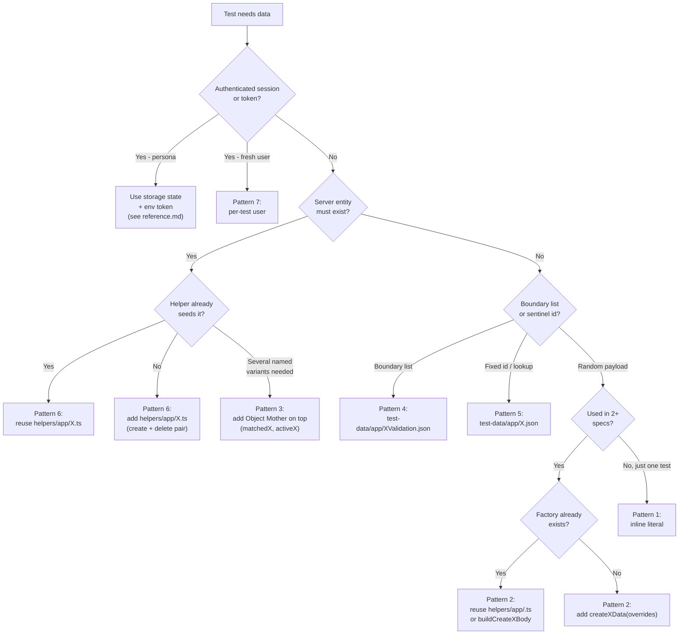
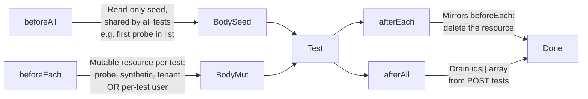
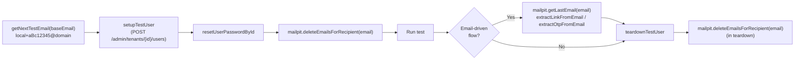

# Data Strategy Skill

Single source of truth for **where test data comes from** in this framework. Sister skill to `api-testing` (which covers **how API responses are asserted**). Cross-link: see [~/.claude/skills/api-testing/SKILL.md](../api-testing/SKILL.md) when the data feeds an API spec.

## What's in each file

| File | Purpose | Load When |
|------|---------|-----------|
| **`SKILL.md`** (this file) | **Rules, decisions, anti-patterns.** Storage-location map, seven blessed patterns, decision tree, forbidden locations. | **Always** — on any test-data / helper / fixture / payload task. |
| **`reference.md`** | **Catalog of facts.** Inventory of existing factories, JSON files, Mailpit fixture, faker calls in use, env-token catalog. | **Load on lookup** — "Does a factory for X already exist?" / "Which JSON file holds boundary values?" |
| **`patterns.md`** | **Pattern recipes with code.** Full skeletons for each of the seven blessed patterns. | **Load During Authoring** — when picking and writing a specific pattern. |
| **`refactor-playbook.md`** | **Migration playbook** for moving existing test data into the canonical pattern. | **Load only when refactoring** existing data wiring (not for new data). |

## Critical

- **NEVER** redefine universal type-mismatch arrays (`[123, true, null, undefined]`, etc.) inline in a spec, helper, or schema. Import from [`fixtures/api/invalid-types.ts`](../../../fixtures/api/invalid-types.ts) (`invalidString`, `invalidStringTypes`, `invalidNumber`, etc.). Why: every API spec needs the same negative coverage; inlining duplicates the contract and produces drift across resources.
- **NEVER** re-declare an array or constant that already exists in `test-data/app/*.json`. Import it (`import alertsData from "../../../test-data/app/alerts.json"`) and reference the property (e.g. `alertsData.severities`). Before adding a local constant, search `test-data/app/` for the value. Why: duplicated constants diverge silently when only one copy is updated.
- **NEVER** generate app-defined strings with Faker — error messages, button labels, toast text, page headings, validation messages all live in [`enums/app/*`](../../../enums/app). Why: Faker output is random; app-defined strings are contracts the UI emits verbatim. Encoding them in `enums/` keeps spec assertions in sync with the running UI.
- **NEVER** hardcode test content strings (names, emails, todo text, monitor names, descriptions) in a spec. Generate with `faker.<...>` (e.g., `faker.string.alphanumeric(6)`) for uniqueness — required for parallel safety. Why: hardcoded names collide under `fullyParallel: true`; the framework runs every spec concurrently.
- **NEVER** store fixed expected values used in a single assertion in a `test-data/app/*.json` file. Keep them inline in the test. Why: single-use sentinels in JSON force readers to jump files for one literal; only multi-use sentinels (`invalidId`, `nonExistentId`, boundary matrices) earn a JSON home.
- **NEVER** introduce magic numbers (timeouts, retry counts, page-size limits, polling intervals) inline in helpers or specs. Route through `playwright.config.ts` for test-suite tuning, an enum in `enums/app/*` for domain-level limits, or `appConfig.timeouts.X` from `config/app.ts`. Why: scattered magic numbers can't be tuned centrally and rot independently.
- **ALWAYS** validate factory output with `Schema.parse(...)` and return the Zod-inferred type. Why: a factory that drifts from the API contract produces happy-path data that fails request validation in CI but passes locally — the worst kind of flake.
- **ALWAYS** load the [`refactor-values`](../refactor-values/SKILL.md) skill **before** editing any existing static-data file (`test-data/app/*.json`) or enum value. Why: these edits cascade through every assertion and data-driven loop that consumes them; an uncoordinated edit can silently invalidate dozens of tests.

## Core principle

> Every test creates its own data with the highest-isolation pattern that fits, and removes whatever it created. Shared mutable state across tests is a defect.

## Storage location map — where every kind of data lives

One canonical home per kind of data. Adding a file outside these locations is a smell — search inside the matching folder first.

| Kind of data | Lives in | Owner pattern | Example |
|--------------|----------|---------------|---------|
| **Static — boundary / validation matrices** | `test-data/app/<resource>Validation.json` | Pattern 4 | [test-data/app/httpSyntheticValidation.json](../../../test-data/app/httpSyntheticValidation.json), [test-data/app/sslSyntheticValidation.json](../../../test-data/app/sslSyntheticValidation.json), [test-data/app/mcpSyntheticValidation.json](../../../test-data/app/mcpSyntheticValidation.json) |
| **Static — sentinels & lookup ids** | `test-data/app/<resource>.json` (keys: `invalidId`, `nonExistentId`, `sqlInjectionId`, `xssId`, etc.) | Pattern 5 | [test-data/app/probe.json](../../../test-data/app/probe.json), [test-data/app/synthetic-common.json](../../../test-data/app/synthetic-common.json), [test-data/app/http-synthetic.json](../../../test-data/app/http-synthetic.json), [test-data/app/dns-synthetic.json](../../../test-data/app/dns-synthetic.json) |
| **Static — frontend mock payloads** | `test-data/app/<resource>.json` (used in `route.fulfill`) | Pattern 5 (route stub) | No mock-JSON fixtures in this project today; reserved for future use — see `refactor-playbook.md §4` |
| **Static loader (JSON + transformation)** | `helpers/app/<topic>Loader.ts` (or `testDataLoader.ts`) | Pattern 5 wrapper | No loader helpers in this project today; reserved for future use |
| **Dynamic — typed factory (`createXData`)** | `helpers/app/testDataGenerators.ts` (planned per [`docs/framework-alignment-plan.md` § 6.4](../../../docs/framework-alignment-plan.md)), OR co-located in `helpers/app/<topic>.ts` for topic-specific data today | Pattern 2 | [helpers/app/probes.ts](../../../helpers/app/probes.ts) (`buildCreateProbeBody`, `buildUpdateProbeBody`), [helpers/app/synthetics.ts](../../../helpers/app/synthetics.ts) (`buildCreateSyntheticBody` + 6 sibling per-type builders), [helpers/app/adminUsers.ts](../../../helpers/app/adminUsers.ts) (`generateUserPayload`) |
| **Dynamic — Object Mother (named scenarios)** | Same file as the base factory | Pattern 3 | Planned alongside the centralized `testDataGenerators.ts` (e.g. `createProbeForRegion`, `createMatchedProbeAndSyntheticPair`); none today |
| **Dynamic — request-shape builders (URLs / query strings)** | `helpers/app/<topic>.ts` | Pattern 2 (request shaping) | [helpers/app/probes.ts](../../../helpers/app/probes.ts) (`buildListProbesUrl`), [helpers/app/synthetics.ts](../../../helpers/app/synthetics.ts) (`buildListSyntheticsUrl`) |
| **API seeder (`createX` + `deleteX`)** | `helpers/app/<topic>.ts` (paired) | Pattern 6 | [helpers/app/probes.ts](../../../helpers/app/probes.ts), [helpers/app/synthetics.ts](../../../helpers/app/synthetics.ts), [helpers/app/adminTenants.ts](../../../helpers/app/adminTenants.ts), [helpers/app/adminUsers.ts](../../../helpers/app/adminUsers.ts) |
| **Per-test user lifecycle (admin-API + Keycloak)** | [helpers/app/adminUsers.ts](../../../helpers/app/adminUsers.ts) (`setupTestUser` / `teardownTestUser`); password reset via [helpers/util/keyCloak.ts](../../../helpers/util/keyCloak.ts) (`getAuthenticatedKcAdminClient`, `getUserIdByEmail`, `resetUserPasswordById`) | Pattern 7 | `setupTestUser(apiRequest, mailpit, tenantId, password, lastName, adminToken)` |
| **Per-test user emails (Mailpit plus-addressing)** | [helpers/util/mailpit.ts](../../../helpers/util/mailpit.ts) | Pattern 7 | `getNextTestEmail(baseEmail)`, `MailpitHelper` |
| **Personas — UI session (storage state JSON)** | `.auth/app/<persona>Session.json` (generated; not committed) | Pattern (persona) | [.auth/app/appMainUserSession.json](../../../.auth/app/appMainUserSession.json) |
| **Personas — UI session generator** | [helpers/app/createStorageState.ts](../../../helpers/app/createStorageState.ts) | Pattern (persona) | `createAppStorageState({ email, password, totpSecret, storageStatePath })` |
| **Personas — bearer tokens** | `process.env.USER_ACCESS_TOKEN_*`, populated by [tests/app/login.setup.ts](../../../tests/app/login.setup.ts) | Pattern (persona) | `USER_ACCESS_TOKEN_FULL`, `USER_ACCESS_TOKEN_ADMIN` |
| **Persona credentials (email/password/TOTP)** | `env/.env.<environment>` (shape in [env/.env.example](../../../env/.env.example)); read only inside `login.setup.ts` | Pattern (persona) | See [reference.md §1.3](reference.md#13-user-credentials-email--password--totp-secret-triplets) |
| **URLs and endpoint paths** | [config/app.ts](../../../config/app.ts) (`appConfig.apiUrl`, `appConfig.api.SYNTHETICS`, `appConfig.api.PROBES`, …) | n/a | `appConfig.api.ADMIN_TENANT`, `appConfig.api.SYNTHETICS`, `appConfig.api.PROBES` |
| **Reference enums (Qase suites, monitor types)** | `enums/app/<topic>.ts` | n/a | [enums/app/qase-suites.ts](../../../enums/app/qase-suites.ts) |
| **Zod request/response schemas (the contract)** | `fixtures/api/schemas/app/<resource>.ts` | n/a | `fixtures/api/schemas/app/synthetic.ts`, `fixtures/api/schemas/app/probe.ts`, `fixtures/api/schemas/app/tenant.ts` |

### Forbidden locations

- JSON test data outside `test-data/` → move it under `test-data/app/`.
- Faker payloads inline in a spec when an entity already has a builder → move to `helpers/app/<topic>.ts` or call the existing `buildCreate<X>Body` / `buildUpdate<X>Body`.
- `process.env.USER_ACCESS_TOKEN_*` written outside [tests/app/login.setup.ts](../../../tests/app/login.setup.ts) → forbidden.
- New env vars added without a matching entry in [env/.env.example](../../../env/.env.example) → must be documented.
- Storage-state JSON committed to git → these belong in `.auth/` (gitignored), produced by `login.setup.ts` per environment.

For the full enumeration of every file in each location, see [reference.md](reference.md). The decision tree below picks the right cell of this table for any new piece of data.

## Quick reference — the seven blessed patterns

| # | Pattern | Speed | Isolation | When to use |
|---|---------|-------|-----------|-------------|
| 1 | Inline literal | Instant | Perfect | One-off value, never reused; uniqueness via `faker.string.uuid()` or `Date.now()` |
| 2 | Typed factory with `Partial<T>` overrides | Instant | Perfect | Same shape used in 2+ tests, or a shape that has business rules |
| 3 | Object Mother on top of factory | Instant | Perfect | Named scenarios (e.g. "matched probe+synthetic pair", "online probe in EU") |
| 4 | JSON validation matrix | Instant | Perfect | Boundary lists for negative tests (`httpSyntheticValidation.json`, `sslSyntheticValidation.json`) |
| 5 | JSON lookup / sentinel | Instant | Perfect | Fixed `invalidId`/`nonExistentId`, env-pinned ids (`probe.json`, `synthetic-common.json`) |
| 6 | API seeder helper | Fast | Perfect | An entity must exist in the system before the test runs (probe, synthetic, tenant, user) |
| 7 | Per-test user via admin-API + Keycloak + Mailpit | Fast | Perfect | Tests that need a fresh user (registration, reset-password, invitation, brute-force) |

Personas (main / full / admin / zero) are NOT a separate pattern — they are pre-baked storage states + env tokens; see [reference.md](reference.md) "Storage state catalog" and "Env-token catalog".

## Decision tree — pick a pattern



If you reach a leaf node and the cited file does not exist, that means the seeder/factory is missing — create it, do not inline. See "Search-before-write" below.

## The seven patterns — rules

Code for every pattern (good vs bad, current-drift examples) lives in [patterns.md](patterns.md) — this section carries only the rules.

### Pattern 1 — Inline literal (last resort)

Rules ([patterns.md § Pattern 1](patterns.md)):
- Allowed only when the value is used in exactly one test and has no business rules.
- Uniqueness comes from `faker.string.uuid()`, `faker.string.alphanumeric(N)`, or `Date.now()` — never from a counter at module scope (parallel-unsafe).
- The moment a second spec needs the same shape, promote to Pattern 2.

### Pattern 2 — Typed factory with `Partial<T>` overrides (default)

Target shape per plan § 6.4 — code in [patterns.md § Pattern 2](patterns.md). Mandatory shape:
- Exported `type X` next to the factory; or import it from the matching schema file.
- Function returns the type, takes `Partial<T> = {}` last.
- Defaults are realistic and pass server validation.
- `...options` spread must be the LAST property (overrides win).
- One factory per entity. Per-entity files in `helpers/app/testDataGenerators.ts` (target) or in the topic-specific helper today (e.g. `buildCreateProbeBody` in [helpers/app/probes.ts](../../../helpers/app/probes.ts), `buildCreateSyntheticBody` + 6 sibling per-type builders in [helpers/app/synthetics.ts](../../../helpers/app/synthetics.ts)).

> Drift today: existing `buildCreate<X>Body` builders return `Record<string, unknown>` instead of an exported `XData` type. Refactor playbook §§ 1 + 3 cover the migration.

### Pattern 3 — Object Mother on top of factory

Named scenarios that delegate to the base factory; never re-declare fields. Code in [patterns.md § Pattern 3](patterns.md). Rules:
- An Object Mother MUST call the underlying factory; copy-pasting fields creates drift.
- Object Mothers are pure — no API calls, no Playwright, no env reads.
- Name them by the scenario, not the shape: `createMatchedProbeAndSyntheticPair`, `createProbeForRegion`, `disabledSynthetic`.
- Live in the same file as the base factory.

### Pattern 4 — JSON validation matrix

For boundary lists driving parametrized negative tests. Code in [patterns.md § Pattern 4](patterns.md). Rules:
- Path is `test-data/app/<resource>Validation.json`.
- Top-level keys describe the negative case (`invalidNames`, `invalidTargets`, `validMethods`, `methodsWithBody`).
- Values are arrays of primitives. No partial objects (those belong in code, not JSON).
- Use only when the same matrix is reused in 2+ specs OR when the matrix is large enough to obscure the test.

### Pattern 5 — JSON lookup / sentinel

For fixed ids and environment-pinned references (`probe.json` sentinels like `invalidId` / `nonExistentId`, `synthetic-common.json` boundaries). Code in [patterns.md § Pattern 5](patterns.md). Rules:
- Every spec that needs `invalidId` or `nonExistentId` MUST import from JSON; never inline a fake uuid.
- Each `test-data/app/<resource>.json` file owns the sentinels for that resource. Add new keys here rather than introducing a new file.
- Never put PII or production ids here. The convention is `nonExistentId: "00000000-0000-0000-0000-000000000000"`.

### Pattern 6 — API seeder helper

Target shape per plan § 4.2 (assertion-style `setupX`/`teardownX` pair); current passthrough `createProbe` is interim — code and drift examples in [patterns.md § Pattern 6](patterns.md), migration in `refactor-playbook.md § 3`. Mandatory shape:
- Always exposed as a pair: `setupX` (or `createX`) + `teardownX` (or `deleteX`). The pair lives in the same file.
- **Accepts `overrides?: Partial<T>` and forwards them to the factory** (`body: createXData(overrides)`). A seeder with no override parameter is a refactor target: a test that needs a specific field value (e.g. a fixed `name` to assert on, or a `status: 'disabled'` seed state) cannot use it without forking into a second seeder. Overrides are what make a single seeder reusable across scenarios.
- Body is built by a Pattern-2 factory (`createXData`), never inline. If the factory does not exist, create it first.
- Response is Zod-parsed before return.
- Token comes from `process.env.USER_ACCESS_TOKEN_FULL` (or the documented persona) — never hardcoded, never aliased.
- Used by tests in `beforeAll`/`beforeEach` and matched in `afterAll`/`afterEach`. See "Lifecycle map" below.

### Pattern 7 — Per-test user via admin-API + Keycloak + Mailpit

For flows that require a brand new user. This project provisions users through the tenant admin API (`POST /admin/tenants/{id}/users`), which creates a Keycloak-backed user under the hood; password reset goes through the Keycloak admin client. `setupTestUser`/`teardownTestUser` hook code in [patterns.md § Pattern 7](patterns.md). Rules:
- `getNextTestEmail(baseEmail)` produces `local+<8-char>@domain` from the supplied base email. All plus-addresses route to one Mailpit inbox — parallel-safe.
- `getNextTestEmail` is **synchronous**. Do not `await` it.
- Pair every `setupTestUser` with `teardownTestUser` in `afterEach`/`afterAll`. Wrap the delete in `try {} catch {}` only when the test itself may have already deleted the user.
- For pre-existing personas (main, full, admin, zero) use the storage state + env token instead — see [reference.md](reference.md).

## Lifecycle map — when to seed and when to clean up



Rules:
- `beforeAll` only for **read-only** seeds (e.g. fetching the first probe for GET-by-id tests). Never push to a shared array from `beforeAll`.
- `beforeEach` for resources that the test mutates or that must be unique per run.
- `afterEach` mirrors `beforeEach`; `afterAll` mirrors a `probeIds: string[]` array filled inside POST tests.
- The id-array pattern is the canonical leak guard for POST suites:

```typescript
test.describe('POST /probes', () => {
    const probeIds: string[] = [];

    test('Create probe', async ({ apiRequest }) => {
        const { body } = await apiRequest<CreateProbeResponse>({ /* ... */ });
        probeIds.push(body.probeId);
    });

    test.afterAll(async ({ apiRequest }) => {
        for (const id of probeIds) {
            await apiRequest<null>({
                method: 'DELETE',
                url: `${appConfig.api.PROBES}/${id}`,
                baseUrl: appConfig.apiUrl,
                headers: process.env.USER_ACCESS_TOKEN_FULL,
            });
        }
    });
});
```

## Per-test user lifecycle (Pattern 7 detail)



## Parallel-safety rules

The framework runs `fullyParallel: true` (see [playwright.config.ts](../../../playwright.config.ts)). Data must be independent per worker AND per test.

1. **Uniqueness sources** — `faker.string.uuid()`, `faker.string.alphanumeric(N)`, `Date.now()`, `getNextTestEmail(baseEmail)`. Module-level counters (`let counter = 0`) are forbidden.
2. **No mutable module state** — factories and Object Mothers are pure functions of their inputs.
3. **Faker seeding** — the framework does not globally seed faker. If you need a reproducible failure, seed at the start of the test with `faker.seed(testInfo.testId.split('').reduce((a, c) => a + c.charCodeAt(0), 0))`. Do not seed in factories themselves.
4. **`process.env` writes** — only [tests/app/login.setup.ts](../../../tests/app/login.setup.ts) may write `process.env.USER_ACCESS_TOKEN_*`. Specs and helpers READ env vars; they never write them.
5. **Per-test user emails** are intrinsically parallel-safe via plus-addressing.
6. **Storage states** are read-only files; multiple workers can share them. Personas that need to mutate user attributes during a test must use Pattern 7, not a shared storage state.
7. **Don't share helper-returned objects** — if `createProbe` returns `body`, the consuming test owns it; don't cache it across describes.

## Search-before-write — the DRY enforcement loop

Before adding ANY of: a faker payload in a spec, a new factory, a new API helper, a new env token reference, or a new JSON file — run these searches.

```bash
# Is there already a factory for this entity?
rg "create<Entity>Data|generate<Entity>Data|build<Entity>Body" helpers/

# Is there already an API seeder?
rg "create<Entity>\b|delete<Entity>\b" helpers/app/

# Is the same JSON sentinel already declared?
rg "<Entity>" test-data/

# Is the persona already covered by an env token?
rg "USER_ACCESS_TOKEN_|ADMIN_ACCESS_TOKEN_" env/.env.example tests/ helpers/
```

Decision rules:
- A hit on factory or seeder = consume it. Do NOT duplicate. If it lacks an override you need, ADD an override; do not fork.
- A hit on env token = use the canonical name; never alias to `const token = process.env.X`.
- A hit on JSON = add a key to the existing file; do not create a parallel file.

For per-area scopes, see the catalogs in [reference.md](reference.md).

## SOLID checklist for data code

- **SRP** — One factory per entity, one API seeder per entity, one storage-state creator per area. The minute a helper does two unrelated things, split it.
- **OCP** — Factories accept `Partial<T>` overrides. Add new scenarios via Object Mothers or new overrides; don't edit the factory's defaults to satisfy a single test.
- **LSP** — Object Mother return types must be assignable to the base factory's return type (use the same `Type` everywhere).
- **ISP** — Don't pass a "god params" object to a helper. `createProbe(apiRequest, body, headers)` + `setupTestUser(apiRequest, mailpit, tenantId, password, lastName, adminToken)` is better than one mega-helper that does everything.
- **DIP** — Helpers depend on the `ApiRequestFn` abstraction (from [fixtures/api/api-types.ts](../../../fixtures/api/api-types.ts)), never on `request` directly.

## Anti-patterns catalog

| Anti-pattern | Why it's wrong | Fix |
|--------------|----------------|-----|
| Inline `faker` payload in a spec for an entity that has a builder | Drift; rule changes hit one place but not others | Import the builder; if the builder lacks a field, add `Partial<T>` override |
| Two near-identical generators (e.g. `createXData` + `createXDataForUI`) | Drift, more places to update | One factory + one Object Mother variant |
| Module-level counter for uniqueness (`let n = 0`) | Parallel-unsafe; collides across workers | `faker.string.uuid()`, `faker.string.alphanumeric(N)` |
| `const token = process.env.USER_ACCESS_TOKEN_X` aliased then passed around | Hides the canonical name; grep misses it | Use `process.env.USER_ACCESS_TOKEN_X` directly at the call site |
| Hardcoded uuid in a spec for "non-existent" id | Magic value; can't be updated centrally | `test-data/app/<resource>.json` `nonExistentId` |
| `await getNextTestEmail()` | The function is synchronous; await produces noise | Drop the `await` |
| `Math.random()` based amount generators ([helpers/util/dataGenerator.ts](../../../helpers/util/dataGenerator.ts) `generateRandomAmount`) | Bypasses the project's faker-everywhere convention | `faker.number.float({ min, max, multipleOf: 0.01 })` |
| API seeder that builds its body inline with faker | Couples seeding (HTTP) and shaping (factory) — violates SRP | Body comes from a Pattern-2 factory; seeder only POSTs and parses |
| Storage state mutated during a test | Breaks isolation for parallel workers | Pattern 7 (per-test user) or a fresh persona |
| Mock JSON used as if it described a live backend resource | Drift between mock JSON and real backend | Pattern 6 + Pattern 7; keep mocks only for purely-frontend assertions |

## Self-review checklist (10 items)

Before finishing any data-related change, confirm:

- [ ] Every faker call in a spec is for a value used in only that spec; reusable shapes live in a factory.
- [ ] Every `process.env.*` token is the canonical name from [reference.md](reference.md), not aliased locally.
- [ ] Every entity created in the test has a matching delete in `afterEach` or `afterAll`.
- [ ] Every JSON import points to `test-data/app/<resource>.json`; no JSON files live elsewhere.
- [ ] No module-level mutable state (counters, caches, ids) outside of `describe`-scoped arrays drained in `afterAll`.
- [ ] No `Math.random()`; use `faker.*`.
- [ ] No fake uuids inline; sentinels come from JSON or `faker.string.uuid()`.
- [ ] If you wrote a new factory or seeder, you ran the search-before-write commands and confirmed nothing already does this.
- [ ] If your test needs a fresh user, it uses Pattern 7. If it needs a fixed persona, it uses storage state + env token.
- [ ] Object Mothers delegate to factories; factories have not been duplicated to fit a scenario.

## Examples

### Example 1 — a new endpoint needs a payload, and the temptation is a fixture file

**Ask:** "add the create-project API tests; the body needs `name`, `description`, `ownerId`."

The instinct is a `test-data/app/projects.json` with a ready payload. That is the wrong default here, and the seven patterns say why:

1. **`name` must be unique per run.** Two workers, or one rerun before cleanup, and a fixed name collides on the 409 path. Faker, not JSON.
2. **`ownerId` must reference a row that actually exists.** A hardcoded uuid is a hardcoded id — forbidden, and it rots the first time the environment is reset. Resolve it in `beforeAll` by listing users and taking the first, failing loudly if none exists.
3. **`description` is genuinely fixed** — it is not asserted on and not unique. A constant is fine; it belongs with the body builder, not in its own file.
4. **The token comes from `process.env.X!`**, never a file.

The finished shape: a body builder in `helpers/app/` that takes the resolved `ownerId` and a faker name, plus one `beforeAll` that resolves the owner. No new JSON file — which is what § Search-before-write is for.

### Example 2 — two specs start failing on each other

**Symptom:** `projects-crud.spec.ts` passes alone and fails in the suite with a `409` on create.

**Cause, per § Parallel-safety rules:** both specs create a project with a name taken from the same fixed JSON value. Worker A's row still exists when worker B creates, so B collides. The suite is green single-worker and red in CI, which is the signature of shared fixed data.

**Fix:** the name becomes faker-generated per test; the fixed JSON value is deleted rather than renamed, so nothing can reach for it again. Cleanup stays as it was — the bug was never in teardown, it was in the data being shared in the first place.

**Verify:** 5 consecutive isolated runs plus one full-tag run, per `flakiness-triage`.

## Troubleshooting

| Symptom | Cause | Fix |
|---------|-------|-----|
| `409 Conflict` on create, only in CI or only at parallelism | A fixed name from JSON, shared across workers | Faker per test. Delete the JSON value so it cannot be reused. |
| A hardcoded uuid stops resolving after an environment reset | An id was treated as fixed data; ids are environment state, not data | Resolve it at runtime in `beforeAll` and fail loudly when the lookup returns nothing. |
| Test passes locally, `401` in CI | Credentials read from a file, or a storage state older than its token TTL | Tokens come from `process.env.X!`. Re-run the auth setup project before assuming a code bug. |
| Faker produced a value the API rejects | Unconstrained generator against a validated field — a name too long, an email shape the backend refuses | Constrain the generator to the contract, do not loosen the assertion. |
| Two JSON files hold the same constant | § Search-before-write was skipped | Grep before adding. Consolidate into one, then update both consumers atomically per `refactor-values`. |
| Cleanup deletes a row another spec is mid-read on | Data is shared where it should be per-test | Per-test data is the fix; ordering teardown around a shared row only moves the race. |
| A seeded entity survives the run | Creation is not paired with teardown for the failure path | Capture the id at creation and delete in `afterEach`, so an assertion failure still cleans up. |

## See Also

- [`api-testing`](../api-testing/SKILL.md) — where the payloads this skill decides about are consumed, and the cleanup rules that pair with seeding.
- [`helpers`](../helpers/SKILL.md) — body builders and CRUD wrappers are the right home for generated data; signature shape and cleanup ordering live there.
- [`fixtures`](../fixtures/SKILL.md) — per-test users and storage states are injected, not constructed in a test.
- [`config`](../config/SKILL.md) — environment variables and URLs; this skill covers data, that one covers configuration.
- [`enums`](../enums/SKILL.md) — repeated strings belong there, not in a test-data file.
- [`refactor-values`](../refactor-values/SKILL.md) — read before changing any existing fixed value; consumers must update atomically.
- [`flakiness-triage`](../flakiness-triage/SKILL.md) — shared fixed data is a leading cause of the cross-test interference that skill diagnoses.
- Orchestrator: [`~/.claude/CLAUDE.md`](~/.claude/CLAUDE.md) — § Sources of Truth and the WON'T rule against hardcoded ids both constrain every decision here.
## Additional resources

- [reference.md](reference.md) — env-token catalog, JSON file catalog, helper catalog, storage state catalog, faker recipes.
- [patterns.md](patterns.md) — side-by-side good/bad examples for each pattern.
- [refactor-playbook.md](refactor-playbook.md) — ordered refactors for the duplication hot spots already in the codebase.
- Sister skill: [~/.claude/skills/api-testing/SKILL.md](../api-testing/SKILL.md) — how API responses are asserted with Zod (this skill answers "where does the request body come from?").
