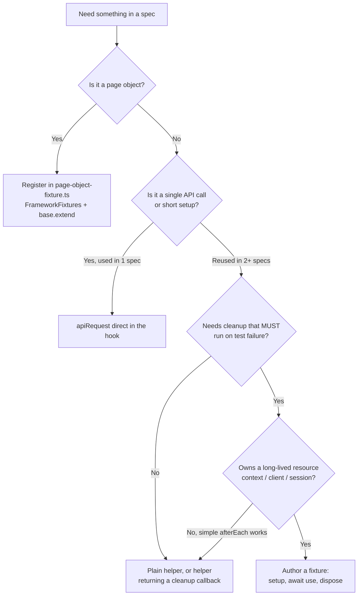

# Fixtures

## What's in each file (read this before reaching for another file)

| File | Purpose | Load When |
|------|---------|-----------|
| **`SKILL.md`** (this file) | **Rules, decisions, anti-patterns.** How to decide whether you need a fixture and how to author one correctly. | **Always** — on any fixture / DI task. |
| **`reference.md`** | **Catalog of facts.** Full fixture inventory (every POM + `apiRequest` / `loginUser` / `mailpit`), env-var dependency map, storage-state & token catalog, plain-functions-not-fixtures, and the anti-catalog of what the framework deliberately does NOT do. | **Load on lookup** — "Which POMs are registered?" / "What env vars does `mailpit` need?" / "What storage state does `login.setup.ts` produce?" |
| **`recipes.md`** | **End-to-end wiring scenarios.** Add a POM fixture, seed-via-`apiRequest` in a UI spec, mailpit email loop, guest flow, `storageState` override, add a persona, domain fixture owning a context, `apiRequest`-dependent fixture, `mergeTests`, helper-with-cleanup, debug table. | **Load during authoring** — you're wiring a new fixture or a new fixture consumer. |

**Boundary rule:** decisions and rules live in `SKILL.md`; the inventory lives in `reference.md`; wiring skeletons live in `recipes.md`. If you find inventory in `SKILL.md`, it is drift — move it to `reference.md`.

## Critical

Non-negotiable. Every rule below is enforced by the orchestrator (`~/.claude/CLAUDE.md` MUST table) or has bitten the codebase before.

- **ALWAYS** import `test` and `expect` from `fixtures/pom/test-options.ts` in spec files. **NEVER** import them from `@playwright/test` in a spec — fixtures will be `undefined` and TypeScript loses the merged types.
- **ALWAYS** receive page objects via fixture DI. **NEVER** call `new SyntheticsPage(page)` (or any other POM constructor) inside a spec, `beforeEach`, or helper. Page objects are registered in `fixtures/pom/page-object-fixture.ts`; specs destructure them.
- **ALWAYS** add new fixtures to the `mergeTests(...)` call in `fixtures/pom/test-options.ts`. A fixture file that isn't merged is invisible to specs.
- **Default fixture scope is `{ scope: 'test' }`.** Use `{ scope: 'worker' }` only for genuinely expensive shared setup (auth storage state, full app boot). Misusing `worker` causes shared mutable state across parallel tests — silent flake. The framework has **no** `worker`-scoped fixtures today.
- **File naming is `<name>-fixture.ts` (kebab-case).** Examples: `page-object-fixture.ts`, `api-request-fixture.ts`, `mailpit-fixture.ts`, `login-fixture.ts`. CamelCase fixture filenames are drift — do not introduce.
- **Fixture lifecycle is `setup → await use(value) → teardown`.** Code after `await use(value)` is the teardown and runs even if the test fails. Code before `await use(...)` is the setup. Skipping `await use(...)` means the test never sees the fixture.
- **The decisive reason to choose a fixture over `beforeEach`/`afterEach` is guaranteed teardown on failure.** Playwright runs the post-`use` block even if the test threw; a manual `afterEach` can be skipped in some failure modes. If the setup needs no failure-safe cleanup, it is a helper or an inline hook — not a fixture. (The full `apiRequest`-direct vs helper vs fixture decision is owned by `api-testing` § Three callable shapes.)
- **Keep the fixture body trivial.** A POM fixture body is `await use(new XPage(page))`. A service fixture builds a context, `await use(...)`, then disposes. Anything more — token refresh, retry loops, env branching — belongs in a helper the fixture body calls.
- **No conditional fixtures.** A fixture either provides a value or it does not. Branching by env/browser inside a fixture body is a smell — branch in the POM/helper instead.
- **Composition is a one-way DAG.** Dependency direction is `service/POM → apiRequest`, never back (`loginUser` depends on `apiRequest`; `apiRequest` must not depend on `loginUser`). A cycle surfaces as a `mergeTests` runtime error.
- **Prefer `mergeTests` over chained `.extend()` for unrelated concerns.** `mergeTests` keeps fixture modules independent and re-orderable; a chain forces a single linear dependency. Fixture names are global on the merged surface — a duplicate name fails at runtime.
- **Page object registration is centralized.** New POMs go into the existing `FrameworkFixtures` type and `base.extend<FrameworkFixtures>({...})` in `fixtures/pom/page-object-fixture.ts` — do not create one fixture file per page object, and do not register them with an `Object.fromEntries(...)` factory loop (breaks TS narrowing and jump-to-definition).
- **Schemas, helpers, and configuration values do NOT belong in fixtures.** Schemas live under `fixtures/api/schemas/`, helpers under `helpers/`, config under `config/`. A fixture orchestrates lifecycle — it does not own data shape or business logic.

## Do I need a fixture at all?

The POM axis is unconditional (POMs are always fixtures). The API axis defers to `api-testing` § Three callable shapes. The service-client axis (owns a context/connection) is the one case that genuinely earns a new fixture file.

## Fixture inventory

The full, current inventory (every registered POM, `apiRequest` / `loginUser` / `mailpit`, env-var map, storage-state & token catalog) lives in **`reference.md`**. Keep it there — do not re-inline it here. When you add a fixture, update `reference.md § 1`.

**Drift to be aware of** (do not propagate):
- `fixtures/forgot-password.spec.ts` is a misplaced spec — specs belong under `tests/app/**`, not under `fixtures/`. Do not author new specs here.

## test-options.ts — the merge point

`fixtures/pom/test-options.ts` is the single source of truth for `test` and `expect` in every spec. It calls Playwright's `mergeTests(...)` to combine four fixture layers (page objects, `apiRequest`, login, mailpit) into one `test` export, and re-exports `expect` from `@playwright/test`. Specs always import `{ expect, test }` from this file (relative path varies by spec depth — e.g. `../../../fixtures/pom/test-options` for `tests/app/api/*.spec.ts`).

When you add a new fixture, you append it to the `mergeTests(...)` call here. That is the only step that makes the fixture visible to specs — without it, the file might exist on disk but specs cannot destructure it.

## Authoring a new fixture — workflow

Walk these steps in order. Stop at any step where the artifact already exists; reuse over duplication.

1. **Decide whether you need a fixture at all.** Load the `api-testing` skill § Three callable shapes and apply its decision rule. The summary: `apiRequest` direct in the spec is the default; promote to a helper function on the second use; promote to a fixture only when 3+ specs need the same setup with **guaranteed teardown** (auto-cleanup on test failure). If you don't clear that bar, do not write a fixture.
2. **Pick the right home.** New page object → extend `FrameworkFixtures` and the `base.extend(...)` block in `fixtures/pom/page-object-fixture.ts`. New API-side fixture → new file under `fixtures/api/<name>-fixture.ts`. New service / cross-cutting fixture → new file under `fixtures/services/<name>-fixture.ts`. Do not invent a new top-level directory.
3. **Name the file `<name>-fixture.ts` (kebab-case).** Match the existing names in the inventory.
4. **Type the fixture's value.** Either inline (`base.extend<{ mailpit: MailpitHelper }>({...})` — see `mailpit-fixture.ts`) or via a named type alias (`FrameworkFixtures` for page objects, `ApiRequestMethods` for `apiRequest`). Export the type when callers outside the fixture file will reference it.
5. **Implement `setup → await use(value) → teardown`.** Setup runs before the test, the value is yielded via `await use(value)`, teardown runs after the test (even on failure). Code that runs only on success belongs **inside** the test, not in the fixture.
6. **Pick scope.** Default `{ scope: 'test' }` — re-runs setup per test, isolated. Only use `{ scope: 'worker' }` for genuinely expensive shared setup that must survive across tests in the same worker (auth storage state). See § Fixture scoping.
7. **Merge into `fixtures/pom/test-options.ts`.** Append the import and add the fixture to the `mergeTests(...)` call. This is non-optional — without this step the fixture is invisible to specs.
8. **Document gotchas in JSDoc** above the fixture body — what it sets up, what it tears down, env vars it depends on, recipient-domain quirks (Mailpit), token expiry, etc. Future authors trip on the same wires.

## Fixture scoping rules

| Need | Scope | Why |
|------|-------|-----|
| Per-test page objects (`syntheticsPage`, `createMonitorPage`, …), per-test mailbox handle, per-test `apiRequest` | `test` (default) | Re-runs setup per test → isolation. The whole inventory above runs on `test` scope |
| Genuinely expensive shared setup — auth storage state minted once per worker, full app boot, a seeded tenant the entire spec file shares read-only | `worker` | One setup per Playwright worker process. **Teardown runs once per worker, not per test.** Misuse = shared mutable state across parallel tests = silent flake |

The current codebase uses **only `test` scope** — there are no `worker`-scoped fixtures merged into `test-options.ts` today. If you reach for `worker`, the bar is high: prove the setup is shareable AND read-only AND expensive. Auth storage minted by `tests/app/login.setup.ts` is the canonical fit; build per-test data with `apiRequest` directly or a helper, not a `worker` fixture.

## Framework notes (rationale for existing choices)

- **Why `mailpit` builds its own `APIRequestContext`.** `apiRequest` is hard-wired to send `Authorization: Bearer <token>`; Mailpit needs `Authorization: Basic <base64>`. That auth-shape mismatch is why `mailpit-fixture.ts` calls `request.newContext(...)` itself — and why it **must** `await context.dispose()` in teardown. Do not try to route mailbox calls through `apiRequest`.
- **`login.setup.ts` conventions.** It imports `test` from `fixtures/pom/test-options` (same runner/fixture surface as specs, so future setup tests can reach `apiRequest`/`mailpit` without changing the import) and calls `qase.ignore()` in **every** setup test — these are storage/token generators, not real test cases, and would otherwise pollute Qase signal. Any new setup test must do both.
- **`resetStorageState` clears cookies + permissions only — NOT `localStorage`/`sessionStorage`.** If a spec depends on client-side storage being wiped (e.g. a "first visit" banner keyed off `localStorage`), clear it explicitly; `resetStorageState` will not.

## Anti-patterns

- ❌ `new SyntheticsPage(page)` (or any POM constructor) inside a spec, `beforeEach`, or helper. Always destructure from the fixture: `async ({ syntheticsPage }) => { ... }`.
- ❌ `import { test, expect } from "@playwright/test"` in a spec. Always import from `fixtures/pom/test-options`. The orchestrator's MUST table flags this as a hard rule.
- ❌ Authoring a fixture file under `fixtures/` and forgetting to `mergeTests(...)` it in `test-options.ts`. The file is dead — specs cannot see it.
- ❌ One fixture file per page object (`synthetics-page-fixture.ts`, `dashboard-page-fixture.ts`, …). Page objects share `page-object-fixture.ts`; extend `FrameworkFixtures` and the `base.extend` block. The framework deliberately centralizes POM registration.
- ❌ `{ scope: 'worker' }` for per-test state. Forces tests to share mutable data across parallel runs — looks fine until two tests fight over the same record.
- ❌ Fixture body that runs teardown **before** `await use(...)` (or omits `await use(...)` entirely). The test never sees the fixture; the teardown runs on the wrong side of the lifecycle.
- ❌ Fixture that mutates global state (env vars, file system, tenant flags) without restoring it in teardown. The next test in the worker inherits the mutation.
- ❌ Fixture that swallows assertion failures with a `try/catch` around the test body or `await use()`. The orchestrator forbids `try/catch` in tests; a fixture wrapping `use()` in a `try/catch` is the same anti-pattern in disguise. Defensive teardown (e.g. `Promise.allSettled` for cleanup) is fine — silencing test failures is not.
- ❌ Single-spec one-off fixture. If it's used by one spec, it's a `beforeEach` block or an `apiRequest` direct call (see `api-testing` § Three callable shapes). Promote on the third spec, not the first.
- ❌ CamelCase fixture filenames (`pageObjectFixture.ts`, `mailpitFixture.ts`). Use `<name>-fixture.ts` (kebab-case). Match the existing inventory.
- ❌ Authoring a Zod schema, `appConfig` value, or business-logic helper inside a fixture file. Schemas live under `fixtures/api/schemas/`, config in `config/`, helpers in `helpers/`. The fixture orchestrates lifecycle, nothing else.
- ❌ Writing a spec under `fixtures/` (the existing `fixtures/forgot-password.spec.ts` is drift). Specs go under `tests/app/api/`, `tests/app/e2e/`, or `tests/app/functional/`.
- ❌ Navigation or `waitForLoaded()` inside a POM fixture body (`await use(new X(page).goto())`). Forces every test that destructures the POM to pay the navigation cost even if it never visits that page. Navigation belongs in the spec or a POM `open()` method; the fixture body is just `await use(new XPage(page))`.
- ❌ `Object.fromEntries(Object.entries(poms).map(...))` to register POMs. Looks clever, breaks TypeScript narrowing inside test bodies, defeats jump-to-definition, adds runtime indirection for zero saving. List each POM explicitly. Reject in review.
- ❌ Re-aliasing a destructured fixture (`const m = markets;`). Use the destructured name so readers can grep it.
- ❌ `auto: true` fixtures. Implicit fixtures hide cost and surprise readers — every fixture is explicitly destructured in the signature.
- ❌ An auto-login / "loggedInUser" fixture. Couples persona selection to the fixture and blocks per-spec overrides. Personas come from storage state + env tokens; specs pick a persona via the project or `test.use({ storageState })`.

## Self-review checklist

Before declaring a fixture change done:

- [ ] The fixture file lives in the right directory (`fixtures/pom/`, `fixtures/api/`, or `fixtures/services/`) and uses kebab-case `<name>-fixture.ts` naming.
- [ ] New fixture types are added to the appropriate type alias (`FrameworkFixtures` for page objects; inline `<{ name: T }>` or a named type for others).
- [ ] The fixture is merged into `mergeTests(...)` in `fixtures/pom/test-options.ts`.
- [ ] Scope is `{ scope: 'test' }` unless the fixture is genuinely expensive shared setup (then `{ scope: 'worker' }` with a one-line justification in JSDoc).
- [ ] Lifecycle is `setup → await use(value) → teardown`. Teardown reverts every mutation made in setup (cookies, mailbox, env, files, DB).
- [ ] Page-object fixtures are added to `page-object-fixture.ts` — not a new file per POM.
- [ ] No spec or helper does `new <PageObject>(page)`; consumers receive the POM via destructuring.
- [ ] Specs that use the new fixture import `test` / `expect` from `fixtures/pom/test-options`, not from `@playwright/test`.
- [ ] JSDoc documents env-var dependencies (e.g. `MAILPIT_USERNAME`, `API_URL`), recipient-domain quirks, and any token / cleanup gotchas.
- [ ] The decision to author a fixture (vs a helper or `apiRequest` direct) was made by the `api-testing` skill § Three callable shapes — not invented here.
- [ ] No schema, config value, or business-logic helper has been smuggled into the fixture file.

## Examples

### Example 1 — Adding a new page-object fixture (`alertsPage`)

User says: *"Expose the new Alerts page to tests via a fixture."*

1. Step 1 — `apiRequest` direct vs helper vs fixture: this is a page object, not API setup, so the question doesn't apply — POMs always go through `page-object-fixture.ts`.
2. Step 2 — Right home: extend `FrameworkFixtures` and the `base.extend` block in `fixtures/pom/page-object-fixture.ts`. **Do not create `alerts-page-fixture.ts`.**
3. Step 4 — Add `alertsPage: AlertsPage;` to the `FrameworkFixtures` type alias and add `alertsPage: async ({ page }, use) => { await use(new AlertsPage(page)); }` to the `base.extend` block. Default `test` scope (no scope option needed).
4. Step 7 — `page-object-fixture.ts` is already merged into `test-options.ts` via `pageObjectFixture` — **no change to `test-options.ts` required** for new POMs.
5. Consume in specs: `test("...", async ({ alertsPage }) => { ... })`. Never `new AlertsPage(page)` inside the spec.

### Example 2 — Why `apiRequest` is a fixture, not a helper

The `apiRequest` fixture in `fixtures/api/api-request-fixture.ts` wraps Playwright's built-in `request` (an `APIRequestContext`) into a typed `<T>(params) => Promise<{ status, body: T }>` function. It is a fixture — not a helper — for two reasons rooted in the lifecycle:

- **DI of `request`.** Playwright provides a fresh `APIRequestContext` per test scope. The fixture closes over that context, so every spec gets the same shape (`apiRequest({ method, url, baseUrl, body, headers })`) without re-acquiring the context manually.
- **Lifecycle hook for the wrapper, not the contract.** The fixture body uses `await use(apiRequestFn)` — the wrapper itself has no teardown today, but the lifecycle scaffolding is already in place if cross-cutting concerns (default headers, retry, instrumentation) need to be added later. A plain helper would have to be re-imported in every spec and would lose the per-test `request` injection.

This is the canonical "fixture justification" shape — the fixture earns its complexity by hosting Playwright lifecycle (`request` injection) and being merged once at `test-options.ts` so every spec receives it without ceremony.

### Example 3 — Authoring a setup-style fixture for a recurring precondition

User says: *"Every synthetics-mutation test needs a probe seeded first. Should I write a `seededProbe` fixture?"*

1. Step 1 — Apply `api-testing` skill § Three callable shapes. The setup is reused across multiple specs AND chains 2+ API calls (probe create + capture id) AND needs guaranteed teardown (delete the probe even if the test fails). That clears the fixture bar.
2. Step 2 — New file under `fixtures/api/seeded-probe-fixture.ts` (API-side resource → `fixtures/api/`). Build it on top of `apiRequestFixture` so the new fixture inherits `apiRequest` — same pattern as `login-fixture.ts` extending `baseApiRequestFixture`.
3. Step 5 — Lifecycle: setup builds the body via the existing `buildCreateProbeBody()` helper, calls `apiRequest`, parses the response with the matching schema, and yields the typed probe id. After `await use(...)`, teardown calls the project's `cleanupProbes(apiRequest, [probeId], headers)` helper (tolerates 404).
4. Step 6 — Scope `test`. A `worker`-scoped probe would be shared across every test in the worker, defeating the per-test isolation and risking 409 on synthetics that bind to it.
5. Step 7 — Append to `mergeTests(...)` in `fixtures/pom/test-options.ts`. Without this, specs cannot destructure `{ seededProbe }`.
6. Step 8 — JSDoc the fixture with the env-var requirement (token), the cleanup helper used, and the synthetics-before-probes ordering quirk that makes teardown 409-safe only via `cleanupProbes` / `cleanupProbesAndSynthetics`.

## Troubleshooting

| Symptom | Cause | Fix |
|---------|-------|-----|
| TypeScript: `Property 'syntheticsPage' does not exist on type 'TestArgs'` (or fixture is `undefined` at runtime) | Spec imports `test` / `expect` from `@playwright/test` instead of `fixtures/pom/test-options` | Replace the import: `import { expect, test } from "../../../fixtures/pom/test-options";` (relative path varies by spec depth) |
| New fixture file exists on disk but specs cannot see it | Forgot to merge into `fixtures/pom/test-options.ts` | Append the import and add the fixture to the `mergeTests(...)` call. That is the only step that wires it through |
| Tests share mutable state mid-suite (a record one test created appears in the next test) | Fixture is `{ scope: 'worker' }` when it should be `{ scope: 'test' }` | Switch to `test` scope. Use `worker` only for read-only, expensive, shareable setup |
| Teardown didn't run after a test failure | Teardown code is placed **before** `await use(...)`, OR `await use(...)` was omitted, OR the fixture itself threw before reaching `use()` | Restructure as `setup → await use(value) → teardown`. If setup can throw, wrap it so the failure is reported but resources you did create still get cleaned up |
| Fixture bound to env vars works locally but fails in CI | Env var is missing or differently-named in the CI runner (`MAILPIT_USERNAME`, `API_URL`, `APP_MAIN_PASSWORD`) | Verify against `env/.env.example`; surface the missing variable. Do not hardcode the value in the fixture — env values stay in `process.env.*` per the orchestrator's MUST table |
| `apiRequest` returns 401 from inside a fixture even with a valid token in the spec | Fixture forgot to thread the token through, or the token belongs to a different realm than the endpoint expects | Re-read `api-testing` § Common request recipes for the right token (`USER_ACCESS_TOKEN_FULL`, `USER_ACCESS_TOKEN_ADMIN`, etc.). Anonymous calls **omit** the `headers` property — never pass an empty string |
| New page-object fixture isn't picked up even after editing `page-object-fixture.ts` | Forgot to add it to BOTH the `FrameworkFixtures` type alias AND the `base.extend(...)` block | Add the property to the type, then add the fixture body. TypeScript's type-completion on the test args is the verification |

## See Also

- **`reference.md`** — full fixture inventory, env-var map, storage-state & token catalog, and the anti-catalog of deliberate omissions.
- **`recipes.md`** — end-to-end wiring scenarios (add a POM fixture, seed-in-UI-spec, mailpit loop, guest flow, persona add, domain fixture, `mergeTests`, helper-with-cleanup, debug table).
- **`api-testing`** skill — § Three callable shapes is the canonical decision rule for `apiRequest` direct vs helper function vs helper fixture. This skill defers to it.
- **`selectors`** skill — selectors-vs-POM placement; page-object registration through this skill's `page-object-fixture.ts` is what makes locators reachable from specs.
- **`page-objects`** skill (TBD) — POM class structure (constructor, getters, action methods). When populated, will pair with this skill on every "add a new page object" task.
- **`helpers`** skill — plain utility functions that are NOT fixtures (no `use()` lifecycle). The helper-vs-fixture decision lives in `api-testing` § Three callable shapes.
- **`type-safety`** skill — typing rules for fixture function signatures and yielded values; the canonical `process.env.X!` access pattern (no `??` defaulting at call sites).
- **`scaffold-spec`** skill — when scaffolding a new spec, the fixture import line comes from this skill.
- **`~/.claude/CLAUDE.md`** — orchestrator. Dependency Injection (MUST), Imports (MUST), Fixture scoping (SHOULD) rows are the contract this skill implements.
