# Selectors Skill

Single source of truth for **how UI elements are found and asserted** in this Playwright + TypeScript framework. Sister skills:

- [~/.claude/skills/data-strategy/SKILL.md](../data-strategy/SKILL.md) — where the data the UI is filled with comes from.
- [~/.claude/skills/api-testing/SKILL.md](../api-testing/SKILL.md) — for API specs (no locators).

[~/.claude/CLAUDE.md](../../../~/.claude/CLAUDE.md) holds the always-applied invariants for the project (framework identity, MUST/SHOULD/WON'T tables, domain glossary). UI-specific Locator Priority Hierarchy + POM Method Standards live in this skill (consolidated from the previous `ui-tests.mdc` paired rule). For POM class structure see the sister skill [`page-objects`](../page-objects/SKILL.md).

## What's in each file (read this before reaching for another file)

| File | Purpose | Load When |
|------|---------|-----------|
| **`SKILL.md`** (this file) | **Rules, decisions, anti-patterns.** Teaches the model how to think about selectors and where they live. | **Always** — on any selector / page-object / locator task. |
| **`reference.md`** | **Catalog of facts.** Locator API, ARIA role catalog, web-first assertion catalog, framework testid taxonomy, attribute filters / CSS hooks, FrameLocator API, POM file conventions. | **Load on lookup** — "What's the right `getByRole` for a Radix select?" / "Which testid prefix is used for monitor row actions?" / "What assertions auto-wait?" |
| **`patterns.md`** | **Side-by-side good vs bad examples.** P1–P17, drawn from real page objects. | **Load During Review** — "Show me the right shape for anchor-and-drill" / "Is this `.first()` justified?" / "What does a good toast assertion look like?" |
| **`recipes.md`** | **End-to-end recipes for full UI patterns.** Tables, sheets, Radix dropdowns, confirmation modals, Sonner toasts, iframes, navigation, pagination, downloads, tabs, OTP, hovers, network-confirmed actions, popups, search, async row creation. | **Load During Authoring** — building a new page object for a recurring UI shape; start in the matching recipe. |

**Boundary rule:** decisions, rules, and anti-patterns live in `SKILL.md`. Catalogs of "what exists" live in `reference.md`. Good/bad pattern contrasts live in `patterns.md`. Full end-to-end skeletons live in `recipes.md`. **If you find rule content in a catalog file (or vice versa), it is drift — fix it before adding more.**

## Critical

Non-negotiable. Violating any of these breaks the framework's contract.

- **Default selector priority follows Playwright's recommendation: `getByRole > getByLabel > getByPlaceholder > getByText > getByTestId > getByAltText / getByTitle > page.locator(css)`.** Tests built this way double as accessibility audits. See § Priority hierarchy.
- **Radix exception:** when the element is a Radix primitive (Select, Switch, Dialog, DropdownMenu, Popover, Tabs), OR the visible text changes with state, OR the team has a testid contract (`field-field-*`, `schema-field-*`, `error-*`, `monitor-actions-*`, `data-sonner-toast`), **`getByTestId` jumps to priority 4 (above `getByText`)**. See § Priority hierarchy → The Radix exception.
- **NEVER use XPath.** Not `page.locator('//...')`, not `'xpath=...'`. No exceptions.
- **NEVER use top-level CSS class / id selectors.** `page.locator('.btn-primary')`, `page.locator('#submit')` are forbidden as the **start** of a chain. CSS is acceptable only when chained off a higher-priority anchor (`getByTestId('x').locator('input')`) or anchored on a documented Radix data-attribute (`[data-state="checked"]`, `[data-sonner-toast]`). See § Last-resort CSS.
- **Live-app exploration is mandatory** before writing any selectors — use `npx playwright open` (built into `@playwright/test`). No guessing from wireframes, docs, or screenshots. If `npx playwright open` cannot reach the app or auth fails, **stop and notify the human** — never ship placeholder locators with guessed names. Read the `playwright-cli` skill for the full workflow.
- **String values inside `getByText(...)` come from `enums/app/*` or `enums/util/*`.** Never hardcode repeated UI strings. See the `enums` skill.
- **Every page object covering a form or CRUD operation MUST include feedback selectors** — success, error, field validation, toast, loading, empty state as applicable. See § Feedback & Validation Message Selectors. A POM without feedback selectors is incomplete.
- **Locators are `get` accessors returning `Locator`.** Not async. Not `Promise<Locator>`. Playwright's `Locator` is lazy — it re-queries on every action. See § The nine blessed patterns.
- **Locators interacted with (`click`, `fill`, `hover`, `press`, `setInputFiles`) live in a page object, never inline in a spec.** Inline `page.getBy*` in specs is reserved for one-off arrival markers and toast assertions only. See § Where selectors live — POM vs spec.
- **No `waitForTimeout`, ever.** Use a web-first assertion, `waitForResponse` for known XHRs, or `expect.toPass({ timeout })` for genuinely-flaky reads. See § Web-first assertions.
- **ALWAYS use `exact: true` in dynamic locator methods.** When a method parameter flows into `filter({ hasText: value })` or `getByText(value)`, always use `filter({ has: this.page.getByText(value, { exact: true }) })` or `getByText(value, { exact: true })`. Without it, "QATest9" matches "QATest99" — a silent false positive that passes locally and breaks in production data. This applies to `getRowByName`, `probeLocationCard`, and any method that selects by user-supplied text.
- **Assert a schema-validated submit/confirm button is `toBeEnabled` BEFORE clicking it.** Schema-form validation only enables the button once every required field passes; clicking a still-disabled button silently no-ops and the test races. `await expect(this.createMonitorSubmitButton).toBeEnabled({ timeout }); await this.createMonitorSubmitButton.click();`
- **After every `fill()` on a Radix-wrapped / component-library input, assert `toHaveValue(value)`.** Component libraries occasionally drop characters under fast programmatic input; the assertion catches the drop before the form is submitted. `await input.fill(value); await expect(input).toHaveValue(value);`

## Core principle

> Every locator describes the user-visible role first, falls back to a stable test attribute second, and never depends on implementation classes or DOM position. If a locator can break because the styling changed or a column was added, it's the wrong locator.

## Where selectors live — POM vs spec

This is a strict convention. Audited against this repo's UI specs (`tests/app/e2e/` + `tests/app/functional/`): most specs route locators through page objects under `pages/app/`; the inline `page.getBy*` calls that remain are predominantly tolerated patterns (arrival markers, one-off Sonner toast assertions). Inline `page.locator('css')` is rare and treated as tech debt.

```mermaid
flowchart TD
    A[Need a locator in a spec] --> B{Will it be reused<br/>by 2+ tests<br/>or 2+ steps?}
    B -->|Yes| POM[Define as a getter on the page object]
    B -->|No| C{Type of usage?}
    C -->|Action: click, fill, type, hover, drag| POM
    C -->|Pure assertion only<br/>visible / hidden / text equals| D{Could it be<br/>part of a flow method<br/>like verifyXxx&#40;&#41;?}
    D -->|Yes| POMFlow[Add an assertion method on the POM]
    D -->|No - one-off arrival/empty-state check| Inline[Tolerated inline in the spec]
```



### The rule

| Place | Rule | Example |
|-------|------|---------|
| **Page object getter (default)** | Any locator that is **interacted with**, or **referenced by 2+ tests/steps**, MUST live in a POM file under `pages/**`. | `syntheticsPage.createMonitorButton`, `loginPage.emailInput`, `sideNavigation.navSyntheticsLink` |
| **Page object dynamic method** | Locators parameterized by data (`getRowByName(name)`, `getMetricCardByLabel(label)`) live as POM methods returning `Locator` synchronously. | `syntheticsPage.getRowByName(name)` |
| **Page object assertion method** | A short assertion expressed against a one-off element should be a **method on the POM**, not an inline locator. The framework convention is `verifyXxx()`. | [`SyntheticsPage.verifyNoResults()`](../../../pages/app/SyntheticsPage.ts), [`PoliciesPage.verifyNoResults()`](../../../pages/app/PoliciesPage.ts) |
| **Inline in spec — TOLERATED** | A locator used by a single test, only as an assertion target (not for interaction), where wrapping it in a POM method would inflate the POM with one-off members. | Sonner toast arrival (`page.getByText('Monitor "<name>" created successfully')`), empty-state markers (`expect(page.getByText('No ICMP Metrics Available')).toBeVisible()`) |
| **Inline in spec — FORBIDDEN** | Inline `page.locator('css-class')` in a spec. Inline locator that is **clicked / filled / hovered / typed into**. Inline locator reused across more than one `test()` block. | All current violations should be refactored into POM getters. |

### When inline is OK (the only two cases)

1. **Page-arrival / empty-state markers**: a single string asserted once after navigation or expansion to confirm we're in the expected UI state, when no POM getter exists yet.

   ```typescript
   // tests/app/functional/monitoring-service/synthetics/icmp-monitor-expanded-view.spec.ts
   await expect(page.getByText('No ICMP Metrics Available')).toBeVisible();
   ```

2. **Toast / alert visibility checks**: when the same Sonner toast text is asserted across many tests, and is never interacted with.

   ```typescript
   // tests/app/e2e/monitoring-service/synthetics/icmp-synthetic-monitor.spec.ts
   await expect(
       page.locator('[data-sonner-toast]').filter({ hasText: name })
   ).toBeVisible();
   ```

If you are doing either of these and start to interact with the element (click, fill), **promote it to a POM getter immediately**.

### When inline is NEVER OK

- **Any `page.locator('.css-class')` in a spec.** No exceptions. Wrap it in a POM getter even as a stopgap, with a `// TODO: replace with testid` comment.
- **Any locator used by 2+ tests in the same file.** Move it to a POM getter the moment you copy-paste it.
- **Any locator used for an action (`click`, `fill`, `hover`, `press`, `setInputFiles`).** Always behind a POM method.

### Refactor signal — when to move from spec to POM

If you find yourself writing any of the below in a spec, stop and migrate to a POM:

- A locator chain longer than one step (`page.getByTestId('x').locator('y')`).
- The same locator argument repeated across `expect` calls.
- Any locator derived from a CSS selector.
- A locator that refers to an element with a documented user behaviour (form field, button, sheet, dialog, drawer, table row).

## Priority hierarchy — the actual rule

The default order is Playwright's recommendation: **semantic-first, testid-last**. Tests built this way double as accessibility audits — if `getByRole('button', { name: 'Refresh' })` fails, screen-reader users are also broken, and your test catches it. The **Radix exception** below names the only condition under which `getByTestId` legitimately jumps to position 4.

### Default order (Playwright recommendation — follow unless the Radix exception applies)

| Priority | Locator | When to use |
|----------|---------|-------------|
| 1 | `getByRole(role, { name })` | Native semantic elements: `heading`, `button` (with stable text), `link`, `tab`, `checkbox`, `menuitem`, `dialog`, `row`, `columnheader`, `cell`. Also Radix-mapped roles when reliable: `combobox` (Radix select trigger), `switch`, `option` (when the popover is open) |
| 2 | `getByLabel(label)` | Form inputs with a visible `<label>` association |
| 3 | `getByPlaceholder(text)` | Inputs without a label but with a stable placeholder (used in [pages/app/SyntheticsPage.ts](../../../pages/app/SyntheticsPage.ts) search controls) |
| 4 | `getByText(text, { exact })` | Static UI strings: page titles, success messages, dropdown options, empty-state messages — **only when the text is stable across states and not reused elsewhere on the page** |
| 5 | `getByTestId('...')` | Use when the higher tiers don't apply, OR when the **Radix exception** below promotes it to priority 4 |
| 6 | `getByAltText` / `getByTitle` | Images / elements with `title` attribute |
| 7 | `page.locator(css)` | **Last resort**. Only acceptable when chained off a higher-priority anchor (e.g. `getByTestId('x').locator('input')`), or anchored on a Radix data-attribute (`[data-state="checked"]`, `[data-sonner-toast]`). Never as a top-level selector for app classes |

### The Radix exception — when `getByTestId` jumps to priority 4

This codebase uses **Radix UI primitives** (via shadcn/ui) for nearly every interactive component: `<Select>`, `<Switch>`, `<Dialog>`, `<DropdownMenu>`, `<Popover>`, `<Tabs>`, `<Accordion>`. Radix is "headless" — it provides accessible behavior but renders complex DOM (a Radix `<Select>` is a `role="combobox"` trigger button, a portal-rendered `role="listbox"` popover, a hidden form input, and assorted state attributes — not a native `<select>`).

Three things break the Playwright-default order on Radix:

1. **Visible text changes with state.** A button labeled `Refresh` becomes `Refreshing…` mid-action; a Radix `<Select>` placeholder `Pick a probe` disappears once a value is picked. `getByText('Refresh')` and `getByText('Pick a probe')` work for two seconds and then break.
2. **The role is right, but the accessible name is unreliable.** Radix wrappers nest the user-facing label deep — `getByRole('combobox', { name: 'Target' })` works only when Radix exposes the name correctly (varies by component version and prop usage).
3. **The team has a testid contract.** The frontend systematically emits stable testids: `schema-field-<fieldName>` on every schema-form field **wrapper** and `field-field-<fieldPath>` on the **input/trigger** inside it (per `src/components/schema-form/schema-form.tsx`), `monitor-actions-<id>` on every per-row action button, `error-<fieldName>` on every validation message, `data-sonner-toast` on every toast. These are agreed contracts between FE and QA — they don't change without coordination.

**Promote `getByTestId` to priority 4 (above `getByText`) when ANY of these hold:**

- The element is a Radix primitive (`<Select>`, `<Switch>`, `<Dialog>`, `<DropdownMenu>`, `<Popover>`, `<Tabs>`)
- The visible text changes with state (button labels during loading, Radix placeholders, dynamic counts)
- The team has emitted a testid contract for the element (the `field-field-*`, `schema-field-*`, `error-*`, `monitor-actions-*` prefixes — see [reference.md § 4](reference.md))

**Keep the default order (text above testid) when ALL hold:**

- The element renders as plain HTML, not through a Radix primitive (Keycloak login forms, raw `<button>`/`<input>`, static page content)
- The visible text is part of the contract (page headings, success/error message strings — owned by `enums/app/messages.ts` *when* that file is created; until then, captured strings stay inline per the `enums` skill, single-use), empty-state markers
- No testid exists for the element AND adding one is out of scope

Why this matters: 284 of the locators currently in `pages/` use `getByTestId`, vs 25 that use `getByText`. The codebase already exercises this exception heavily — it's how the team has handled Radix instability without flake. Documenting the rule explicitly so the next author doesn't re-litigate it on every page object.

## Decision tree — pick the right locator

```mermaid
flowchart TD
    Start[Need a locator] --> Q1{Native semantic element<br/>with a stable accessible name?<br/>heading, link, tab, columnheader, etc.}
    Q1 -->|Yes| Role[getByRole with name]
    Q1 -->|No| Q2{Form input with<br/>a visible label?}
    Q2 -->|Yes| Label[getByLabel]
    Q2 -->|No| Q3{Form input with<br/>a stable placeholder?}
    Q3 -->|Yes| Placeholder[getByPlaceholder]
    Q3 -->|No| QR{Radix exception applies?<br/>- Radix primitive Select/Switch/Dialog/...<br/>- text changes with state<br/>- testid contract exists}
    QR -->|Yes| Anchor[getByTestId<br/>plus drill if it's a wrapper]
    QR -->|No| Q4{Stable static UI string<br/>not reused on the page?}
    Q4 -->|Yes - title, message, empty state| Text[getByText with exact: true]
    Q4 -->|No - dynamic / repeated content| TestId[getByTestId<br/>or ask FE to add one]
    Role --> Q5{Multiple matches<br/>expected?}
    Label --> Q5
    Placeholder --> Q5
    Anchor --> Q5
    Text --> Q5
    TestId --> Q5
    Q5 -->|Pick one by content| Filter[.filter&#40;{ hasText }&#41; or<br/>.filter&#40;{ has: &lt;Locator&gt; }&#41;]
    Q5 -->|Pick by position deliberately| Disamb[.first&#40;&#41; / .last&#40;&#41; / .nth&#40;n&#41;<br/>with comment why]
    Q5 -->|All of them| Coll[Use the locator as a collection<br/>and assert with toHaveCount]
    Q5 -->|Exactly one| Done[Done — strict mode<br/>will fail loudly otherwise]
```

If a leaf node forces you to `page.locator('.css-class')` you are in dangerous territory — see "Last-resort CSS rules" below.

## The nine blessed patterns

Each pattern below covers one selector shape. Skeletons live in `patterns.md` (good vs bad) and `recipes.md` (full end-to-end). This section gives the **rule** for when each pattern applies; load the pointed-to file for the code.

### 1. Bare semantic locator (`getByRole` only)

Use ONLY when the element is a real native or ARIA-mapped role AND the accessible name is stable across states. Headings → exact heading text. Buttons whose label changes by state (`"Submit"` vs `"Submitting…"`) → use `getByTestId` instead. **Code:** [patterns.md § P7](patterns.md).

### 2. `getByTestId` — the workhorse

Use when the element has a `data-testid` AND no equivalent stable role. **Naming convention:** kebab-case `<feature>-<element-kind>` (`create-monitor-button`, `delete-monitor-confirm`). Schema-form field wrappers follow `schema-field-<fieldName>` and the inputs/triggers inside them follow `field-field-<fieldPath>` (`field-field-target`, `field-field-checkInterval`) — emitted by `src/components/schema-form/schema-form.tsx` in the frontend. Regex / prefix testids (`getByTestId(/^monitor-actions-/)`) are acceptable for repeating elements (per-row action buttons, per-row health badges). Need a new testid? **Ask the front-end team to add one** rather than dropping to CSS. **Inventory:** [reference.md § 4 Framework testid taxonomy](reference.md). **Adding a new testid:** [reference.md § 4.11](reference.md).

### 3. Anchor + drill (composition over deep CSS) — the most important pattern

**The single most important pattern in this framework.** Use whenever a `data-testid` sits on a wrapper around a native input or a Radix primitive. The top of the chain MUST be a higher-priority locator (testid, role, label). The CSS or role step at the bottom MUST be a generic native element (`input`, `textarea`, `button`, `svg`) or a documented Radix attribute (`[role="combobox"]`, `[data-state="checked"]`, `[role="switch"]`). **Never start the chain with CSS** — `page.locator('.x').getByRole(...)` is forbidden. `.or()` is allowed at the *anchor* level for legacy/current testid duals — never at a downstream step. A second legitimate `.or()` use case is **conditional rendering states** — where the UI shows one of two mutually exclusive elements depending on data presence (e.g., `traceroutePathView.or(tracerouteNoDataTitle)` for a monitor that may or may not have collected data yet). This is appropriate only when the test's assertion explicitly handles both branches; do not use `.or()` to paper over flaky locators — each branch must be a real, expected UI state. **Code (good vs bad):** [patterns.md § P1](patterns.md).

### 4. Filter by text (rows, list items, panels)

Prefer `filter({ hasText })` over CSS contains-text selectors. For ambiguous tables, anchor on the table testid first (`getByTestId('data-table')`). Use `filter({ has: <Locator> })` when you need the parent that contains a specific child. When a primary row has an expanded sibling (`<tr data-testid="expanded-row">`), exclude it with `:not([data-testid="expanded-row"])` to avoid strict-mode double-matches. **Code:** [patterns.md § P3](patterns.md) (filter by row text), [patterns.md § P15](patterns.md) (`filter({ has })` for parent-by-child).

### 5. `getByText` with `exact: true`

Always pass `exact: true` for short strings (`"Edit"`, `"Save"`, `"Cancel"`). Substring matching is fragile and trips strict-mode. Prefer `getByRole('option', { name, exact: true })` for Radix select items when the role is exposed. `getByText` is acceptable for empty-state markers and Sonner toast assertions. **Code:** [patterns.md § P2](patterns.md).

### 6. Dynamic / parameterized locators (methods, not getters)

When the locator depends on runtime data (a row name, enum member, metric label), expose it as a **method**, not a getter. Method name starts with `get` and ends with `By<Discriminator>` (`getRowByName`, `getMetricCardByLabel`, `getHealthBadge`); pure dispatchers like `healthCard(state)` are also acceptable. **Returns `Locator` synchronously**, never `Promise<Locator>`. Build chains internally; consumers should not have to drill again. Prefer enum + map lookup over `if/else` cascades for type-checked dispatch. When a dynamic method chains through `getByText(value)` or `.filter({ hasText: value })`, **always pass `{ exact: true }`** to prevent substring collision across rows (e.g., "QATest999" matching "QATest9999"). The substring risk is higher in dynamic methods because the value is unknown at authoring time. **Visibility:** public when specs or sister POMs assert on the locator; private when only this class's own actions invoke it. **Code:** [patterns.md § P5](patterns.md).

### 7. Sub-component scoping

Every sheet, dialog, expanded-row, or composite component MUST be scoped to a parent locator so its children are unambiguous. Define one anchor locator (`expandedRow`, `sheet`, `dialog`, `expandedRowHeader`) — either as a private `Locator` field assigned in the constructor (when reused by every getter) or as a getter (when also exposed to consumers). Every element inside is `this.<anchor>.<chain>`. Prefer `.filter({ hasText })` over `.filter({ has: this.page.locator('label:has-text(...)') })`; escalate to `has: <Locator>` only when text alone matches too broadly. **This guarantees strict-mode safety** — even when the same testid is reused on an outer toolbar (the page has both a toolbar `auto-refresh-toggle` and an expanded-row `auto-refresh-toggle`), the test never picks it up. **Code:** [patterns.md § P4](patterns.md). **Recipes for sheets / modals / expanded rows:** [recipes.md § 2](recipes.md), [recipes.md § 4](recipes.md).

### 8. Iframe — `frameLocator`

This framework does **not** mount any iframes today (Keycloak login is full-page; no third-party widgets are embedded). The shape below is **prescriptive** — apply when the first iframe ships. Always select the iframe by a stable attribute (`title`, `name`, `id`, or `src*=`). Bare `frameLocator('iframe')` is fragile. Inside the frame the same priority hierarchy applies: testid (when present) → role → label → text. A `FrameLocator` is **not** a `Locator` — expose specific getters (`get passwordInput(): Locator`) that return chained `Locator`s. **Code:** [patterns.md § P6](patterns.md). **Recipes:** [recipes.md § 6](recipes.md).

### 9. The collection pattern

When you legitimately want all matching elements (assert column count, iterate rows): use the locator unmodified and assert via `toHaveCount` or read all texts via `allInnerTexts()`. **Don't call `.first()` / `.nth(0)` to "make it work"** — that hides ambiguity. Use web-first count assertions (`toHaveCount`) instead of `await locator.count()` followed by `expect(n).toBe(...)`. For "the row I created", filter by name (Pattern 4) — never rely on `.last()`. **Recipes (collections in real tables):** [recipes.md § 1](recipes.md), [recipes.md § 16](recipes.md).

## Strict mode — disambiguation rules

Playwright runs locators in strict mode by default: an action on a locator that matches > 1 element throws. Decide on a strategy BEFORE you write the locator:

| Goal | Tool | Example |
|------|------|---------|
| Pick the only match | Nothing — locator must already resolve to one | `getByTestId('create-monitor-button')` |
| There are several, I want a specific one by content | `.filter({ hasText })` / `.filter({ has })` | Row by name, monitor-type card by `/ICMP\|Ping/i` |
| There are several visually identical, I want the first | `.first()` (with comment why) | Page-toolbar refresh button (the "Refresh" sr-only label is reused by the expanded-row refresh; toolbar is always first in DOM) |
| I want all and assert their count/content | Use the locator unmodified with `toHaveCount` / `allInnerTexts()` | Column headers |

`.first()` / `.last()` / `.nth(n)` MUST be a **deliberate** choice, justified by a comment when not obvious. The shared `<RefreshButton>` component's sr-only `"Refresh"` label is reused by both the toolbar and (when rows are expanded) the expanded-row refresh — the toolbar version is always first in DOM order, which makes `.first()` legitimate there. **Code (good vs bad):** [patterns.md § P10](patterns.md).

`.nth(N)` for column position (`.locator('td').nth(2)`) is a smell — see Anti-patterns.

## Feedback & Validation Message Selectors

Every page object that covers a form or CRUD operation **must** include selectors for the feedback the application shows after those operations. These are the most commonly missed selectors and the most important for assertion coverage. A POM with form inputs and a submit button but no success / error / validation locators is incomplete — ship nothing until those are in.

### What to capture

| Feedback type | When it appears | Selector strategy |
|---------------|-----------------|-------------------|
| Success toast (Sonner) | After successful create / update / delete | Filter on `[data-sonner-toast]` by the unique part of the message (the monitor name); never bare `[data-sonner-toast]` (multiple toasts can stack — see [recipes.md § 5](recipes.md)) |
| Error toast (Sonner) | After failed mutation or server error | Same shape as success toast; assert `toContainText(/error|failed/i)` |
| Field validation message | On blur or submit with invalid input | Schema-form fields render errors as `[data-testid='error-<fieldName>']` — pair with `field-field-<fieldPath>` for the input. Generic helpers: `fieldError(name)` / `fieldInput(path)` (see [pages/app/CreateMonitorPage.ts](../../../pages/app/CreateMonitorPage.ts)) |
| Confirmation modal | Destructive action (delete) | Per-feature delete dialog testids (`delete-monitor-dialog` / `delete-monitor-confirm` on [pages/app/SyntheticsPage.ts](../../../pages/app/SyntheticsPage.ts), `delete-probe-dialog` on [pages/app/ProbesPage.ts](../../../pages/app/ProbesPage.ts)) — see [recipes.md § 4](recipes.md) |
| Loading state | During async operations | Spinner / skeleton testid scoped under the data container — `getByRole('progressbar')` when exposed |
| Empty state | List or table with no data | `getByText('No <X> Available', { exact: true })` — the exact strings live in `enums/app/*` (e.g. `Messages.NO_ICMP_METRICS`); inline `getByText` in a spec is tolerated only as a one-off arrival marker (see § Where selectors live) |

> The `Messages.*` member names above are illustrative. **`enums/app/messages.ts` does not exist yet** — see the `enums` skill for the rule (promote to a centralized constant only when the same string is asserted in 2+ specs; until then, the captured string stays inline at the single assertion). Capture the exact rendered string via live-app exploration (see the `playwright-cli` skill — uses `npx playwright open`); never invent a `Messages.*` name.

### Forbidden — feedback-less POMs

A page object covering a form or CRUD operation with **no** selectors for success / error / validation feedback is forbidden. Tests built on it can only assert that the action *happened*, not that it *succeeded*. The POM is incomplete; surface the gap and add the locators before any spec depends on it.

**Code (Sonner toast filter pattern):** [recipes.md § 5](recipes.md). **Code (confirmation modal):** [recipes.md § 4](recipes.md). **Anti-pattern of feedback-less POMs:** § Anti-patterns catalog.

## Web-first assertions — never poll, never sleep

Playwright assertions auto-wait. Use them everywhere; do NOT mix with `await locator.isVisible()` and `expect(...).toBeTruthy()`. The full need → assertion lookup (visibility, value, text, Radix `data-state`, aria, URL, count) lives in [reference.md § 3 Web-first assertions catalog](reference.md).

`waitForTimeout(ms)` is forbidden. If a test "needs a wait", what it really needs is one of:
- A web-first assertion.
- A `waitForResponse` / `waitForRequest` for a known XHR.
- A re-read of a Locator after the triggering action (Locators are lazy).
- An `expect.toPass({ timeout })` retry block when the assertion is genuinely flaky on first read (see [pages/app/SyntheticsPage.ts](../../../pages/app/SyntheticsPage.ts) `expandRow`, `openRowActionMenu`).

### Form interaction hygiene (mutation action methods)

When a POM action method mutates data through a form, follow this shape — it removes the two most common UI-flake sources:

1. **Fill, then confirm the value stuck:** `await input.fill(value); await expect(input).toHaveValue(value);`
2. **Assert the submit button is enabled before clicking:** `await expect(submitBtn).toBeEnabled({ timeout }); await submitBtn.click();`
3. **Bind the click to the known XHR and assert its status** — the status codes are a stable contract: **201** create, **200** update, **204** delete.

```typescript
const [response] = await Promise.all([
    this.page.waitForResponse(
        (r) => r.url().includes('/synthetics') && r.request().method() === 'POST'
    ),
    this.createMonitorSubmitButton.click(),
]);
expect(response.status()).toBe(201);
```

Prefer `waitForResponse` (not `waitForTimeout`) whenever the action triggers a known request; assert the status so a silent 4xx/5xx surfaces immediately rather than as a downstream visibility failure.

## Last-resort CSS — when it's actually OK

Only when ALL of these hold:

1. The CSS step is **not at the top of the chain** (anchor with role/testid/label first).
2. The CSS targets either a native element (`input`, `textarea`, `svg`) OR a documented Radix / framework hook (e.g. `[data-state="checked"]`, `[data-state="open"]`, `[data-sonner-toast]`, `[data-testid^='table-row-']`, `[data-testid^='monitor-actions-']`).
3. There is no testid available AND adding one is out of scope (note that in the comment).

Forbidden CSS:

- App-level class names tracking layout / styling (`.text-muted-foreground`, `.h-10.w-full.overflow-hidden`) at the **top** of a chain. They can appear deep in a chain only when the design system has no testid for the element — see [pages/app/SyntheticsPage.ts](../../../pages/app/SyntheticsPage.ts) `timingStackedBarIn` (acknowledged as tech debt; FE improvement requested).
- Tailwind utility classes (`text-3xl`, `font-bold`, `flex`, `gap-2`, etc.) at **any** position in the chain — even when chained off a higher-priority anchor. Tailwind classes are styling concerns that change with design updates. Prefer `getByText(/pattern/)` for text-content matching or request a `data-testid` from FE.
- Position-based selectors for content (`.locator('td').nth(2)` to grab "the third column").
- Tag-only selectors with no follow-up filter (`page.locator('header')` standalone). Note: `page.locator('header').filter({ hasText: 'X' })` is tolerated because `.filter()` IS the scope — but when a `data-testid` exists, prefer it.
- Legacy attribute syntax `page.locator('[data-testid="x"]')`. Use `page.getByTestId('x')`. The exception is **prefix matching** (`[data-testid^='monitor-actions-']`), which has no `getByTestId` analogue and is acceptable.

## Anti-patterns catalog

| Anti-pattern | Why it hurts | Fix |
|--------------|--------------|-----|
| Top-level `page.locator('.text-muted-foreground')` | App class tracks styling, not semantics; multiple instances collide | Add a `data-testid` and use `getByTestId`; or scope under a higher-priority anchor |
| `.locator('td').nth(N)` for "column X" | Adding/removing a column breaks every row helper | Use a column-name-aware lookup (header testid `sort-header-<columnId>`, or `getByRole('cell')` scoped under a row) |
| `frameLocator('iframe')` (no attribute) | Picks up the wrong iframe when multiple exist | `frameLocator('iframe[title="..."]')` or `[name=...]` / `[id=...]` |
| `getByText('Edit')` without `exact: true` | Matches "Edit monitor", "Edit profile", causing strict-mode failures | `getByText('Edit', { exact: true })` |
| `await page.waitForTimeout(2000)` | Flake guarantee | Web-first assertion or `waitForResponse` |
| `if (await loc.isVisible())` followed by `await loc.click()` | Race condition; `isVisible` snapshots, click re-checks | `await expect(loc).toBeVisible(); await loc.click();` |
| Multiple getters returning the same chain (`createBtn` and `submitBtn` both `getByTestId('create-button')`) | Reader confusion; refactor risk | Define one getter; use comment if the same element has two names by context |
| Single-use locator inlined in method body | Testid is unsearchable; duplication when reused | Promote to a getter |
| Method that performs only `await x.click()` | POM antipattern — see [`page-objects`](../page-objects/SKILL.md) § "No single-action methods" | Inline the click into the larger user-flow method |
| `page.evaluate(() => element.click())` | Bypasses Playwright's auto-wait; hides flake | Use a Playwright `.click()` on the locator |
| Storing `await locator.textContent()` in `beforeEach` and asserting later | Race condition; the page may not have rendered | Use `await expect(loc).toHaveText(...)` directly |

## SOLID checklist for page objects

- **SRP** — One page object per page or component. A "SyntheticsPage" should not also know about Probes. Shared pieces (`BasePage`, `DataTableBase`) live under `pages/baseClasses/` — the directory contains only those two files today.
- **OCP** — Add new locators as new getters; don't widen existing getters with options.
- **LSP** — Sub-classes (extending `BasePage`, `DataTableBase`) MUST keep parent assumptions intact; never override a getter to return a different shape.
- **ISP** — A consumer that needs only shared table behaviour should not have to instantiate the entire `SyntheticsPage`. Keep shared concerns in a base class (`DataTableBase`) or extract a small component.
- **DIP** — Methods accept `Locator` parameters when they need to be reused across different anchors (e.g. `openRowActionMenu(row, menuItem)`, `timingLegendItemIn(card, segment)`).

## Self-review checklist (13 items)

Before finishing any selector-related change:

- [ ] Schema-validated submit/confirm buttons are asserted `toBeEnabled` before the click; every `fill()` on a component-library input is followed by a `toHaveValue` assertion.
- [ ] Mutation action methods that trigger a known XHR bind the click to `waitForResponse` and assert the status (201 create / 200 update / 204 delete) rather than relying on a downstream visibility check.

- [ ] No top-level `page.locator('.css-class')` — every CSS step is anchored on a higher-priority locator.
- [ ] Every getter returns `Locator` and is exported as `get name(): Locator { … }` — no `Promise<Locator>` returns.
- [ ] Every dynamic locator is a method named `get<Thing>By<Discriminator>(...)` returning `Locator` synchronously.
- [ ] No `getByText` without `exact: true` for short strings.
- [ ] No `frameLocator('iframe')` without a stable attribute.
- [ ] Every `.first()` / `.last()` / `.nth(N)` is intentional and either commented or used in a clearly named getter (`refreshButton`).
- [ ] All assertions are web-first (`expect(locator).toBe…`); no `if (await locator.isVisible())` patterns.
- [ ] No `waitForTimeout`; waits are `expect(...)` or `waitForResponse` or `expect.toPass({ timeout })`.
- [ ] Sheet / dialog / expanded-row / tab-panel content is scoped under a single anchor locator. **Every new getter** added to a scoped section chains off the section's anchor (`this.<section>`), not `this.page` — verify by searching for `this.page.getBy` in the section and confirming it's the anchor definition, not a child getter.
- [ ] Action methods include a post-condition assertion (visible/hidden/value/URL change) — see [`page-objects`](../page-objects/SKILL.md) § "No single-action methods — every POM method must include at least one built-in validation".
- [ ] Locators interacted with (click/fill/hover/press) live in a page object, not inline in a spec. Inline `page.getBy*` in specs is reserved for one-off arrival or empty-state assertions only. Reused locators are promoted to POM getters on first duplication.

## Examples

### Example 1 — Add a row-action menu locator to `SyntheticsPage`

User says: *"I need to click the per-row 'Edit' menu item on the synthetics list."*

Walk the workflow:

1. **Phase 1 (explore)** — `npx playwright open --load-storage <storage-state-path> https://<app-host>/synthetics` (path from `playwright.config.ts`). The human navigates and observes: each row has a kebab button with `data-testid` matching `monitor-actions-<id>` (per-row); clicking it opens a Radix menu of items.
2. **Pattern 4 (filter by text)** + **Pattern 6 (dynamic method)** — the row anchor depends on the synthetic name; the action button is a per-row testid prefix.
3. **Add to [pages/app/SyntheticsPage.ts](../../../pages/app/SyntheticsPage.ts):**
    - `getRowByName(name: string): Locator` — already present (Pattern 4).
    - `openRowActionMenu(row: Locator, menuItem: string): Promise<void>` — locates the prefix testid `getByTestId(/^monitor-actions-/)` scoped under `row`, clicks it, then clicks `getByRole('menuitem', { name: menuItem })`.
4. **Validation** — POM method must end in a post-condition. Assert the menu item is hidden (menu closed) before returning, OR verify the next visible UI state (sheet opened, toast shown).
5. **Spec** — `await syntheticsPage.openRowActionMenu(row, 'Edit')`, then assertions on the next state.

### Example 2 — Locate a schema-form field with text fallback

User says: *"The monitor name input has `data-testid='field-field-name'` AND a `<label>Monitor Name</label>`. Which do I use?"*

**Use both, with `.or()` at the anchor level (Pattern 3 — anchor + drill).** The current UI exposes the testid; older specs and any pre-Radix variants expose only the label. `.or()` lets the locator survive either shape:

```typescript
get monitorNameInput(): Locator {
    return this.page
        .getByTestId('field-field-name')
        .or(this.page.getByLabel(/^Monitor Name/i));
}
```

This is the **only** place `.or()` belongs — at the anchor for legacy/current dual hooks, never at a downstream step. **Code:** [patterns.md § P11](patterns.md).

### Example 3 — Confirmation modal for delete

User says: *"Add a 'delete monitor' flow with the confirmation dialog."*

1. **Phase 1 (explore)** — open the synthetics list, click the row-action `Delete`. Snapshot reveals a Radix dialog with role `dialog`, title `Delete Monitor`, body text confirming the monitor name, and two buttons: `Cancel` and `Delete`.
2. **Pattern 7 (sub-component scoping)** — define the dialog as an anchor; chain everything inside it.
3. **Existing infrastructure** — `SyntheticsPage` already exposes the delete-dialog getters (`deleteDialog` → `delete-monitor-dialog`, `deleteConfirmButton` → `delete-monitor-confirm`, `deleteCancelButton` scoped to the dialog). Reuse them rather than re-rolling.
4. **Action method** must validate success: after confirming the dialog, assert the dialog is hidden, the row is gone (`expect(getRowByName(name)).toBeHidden()`) AND the success toast appeared (Sonner pattern, [recipes.md § 5](recipes.md)).

## Troubleshooting

| Symptom | Cause | Fix |
|---------|-------|-----|
| `Error: strict mode violation: locator(...) resolved to N elements` | The locator matches multiple elements; an action is ambiguous | Decide a strategy from § Strict mode — disambiguation rules. Most often: scope to a parent (`getByTestId('data-table')` first), or `.filter({ hasText })` to pick by content. `.first()` only with a comment explaining DOM order. |
| Locator returns "stale" or "element not attached" | Misdiagnosis. `Locator` is lazy; it re-queries the DOM on every action — it never goes stale | Real cause is one of: (a) the element legitimately isn't there yet → `await expect(loc).toBeVisible()` to wait; (b) the selector no longer matches the new DOM → re-snapshot and update; (c) frame/iframe context changed → scope with `frameLocator(...)` |
| Tempted to write XPath because nothing semantic works | Markup likely lacks accessible naming (`<button><svg/></button>`) | Re-snapshot — `aria-label` or visible icon label may give a semantic hook. If truly nothing exists, coordinate with engineering to add `data-testid`; never fall back to XPath. See [reference.md § 4.11 Adding a new test id](reference.md). |
| `page.locator('.btn-primary')` because the button has no accessible name | App class tracks styling, not semantics; unstable across redesigns | First re-check the snapshot for an `aria-label` or hidden role. If absent, request a `data-testid` from FE; until then, anchor under a higher-priority parent and drill (Pattern 3). Never ship a top-level CSS-class locator. |
| Sonner toast assertion is flaky / matches the wrong toast | Bare `[data-sonner-toast]` matches every stacked toast on screen (auto-refresh "Loaded N monitors" can fire alongside "created successfully") | Filter by the unique part of the message — usually the monitor name. Pattern in [recipes.md § 5](recipes.md). Invented `notification-success`/`notification-error` testids do **not** exist in Sonner's DOM — always use the `[data-sonner-toast]` attribute filter. |
| `getByText('Edit')` matches multiple elements | Substring matching catches "Edit monitor", "Edit profile", etc. | Always pass `exact: true` for short strings: `getByText('Edit', { exact: true })`. Or use `getByRole('button', { name: 'Edit', exact: true })` when the role is exposed. |
| Field validation error locator returns nothing | Wrong shape — schema-form errors render at `data-testid='error-<fieldName>'`, not under the field input | Use the existing `fieldError(name)` helper in [pages/app/CreateMonitorPage.ts](../../../pages/app/CreateMonitorPage.ts) or `getByTestId('error-<fieldName>')` directly. Pair with the input testid `field-field-<fieldPath>` for context. |
| Auth fails or `npx playwright open` cannot reach the app | Environment / credentials issue | **Stop and notify the human** with the exact issue and what you need (credentials, storage state path, env vars). Do not generate placeholder locators with guessed names. Re-explore once unblocked. |
| Test calls `await locator.click()` immediately after navigation and races | `Locator.click()` auto-waits but only up to the action timeout; redirects mid-action can race | Use `await expect(locator).toBeVisible()` first to anchor the wait, then click. Or — for actions that trigger a known XHR — combine with `page.waitForResponse(...)` (see [recipes.md § 13](recipes.md)). |

## See Also

- **`page-objects`** skill *(TBD)* — POM class structure (constructor, three locator sections, action methods), JSDoc rules, fixture registration, component composition. **Read alongside this skill** when authoring a new page object.
- **`playwright-cli`** skill — the live-app exploration workflow (uses `npx playwright open`, built into `@playwright/test`). **Mandatory** before generating any new selectors. Pair with `frontend-cross-check` (source) for stable artifacts; `playwright-cli` covers runtime behavior.
- **`frontend-cross-check`** skill — verify testid prefixes (`field-field-*`, `schema-field-*`, `error-*`, `monitor-actions-*`), Radix-primitive claims, and accessible names against `<sibling-repos>/frontend` source before authoring selectors. `git pull` first.
- **`enums`** skill — where suite names, status enums, and (when populated) UI message constants live. Strings inside `getByText(...)` come from here when reused in 2+ specs.
- **`fixtures`** skill — how to register a new page object in `fixtures/pom/page-object-fixture.ts` so specs receive it via DI.
- **`common-tasks`** skill *(TBD)* — prompt templates for "Add a New Page Object (With / Without Exploration)" that chain into this skill.
- **`debugging`** skill — strict-mode violations, "element not found" / "not attached", and other locator-driven test failures.
- **`api-testing`** skill — for API specs with Zod schemas (no locators); sister skill.
- **`data-strategy`** skill — where the data the UI is filled with comes from.
- **[`page-objects`](../page-objects/SKILL.md)** — POM Method Standards, class structure, fixture registration (consolidated from the previous `ui-tests.mdc`).
- **`~/.claude/CLAUDE.md`** — root orchestrator with MUST / SHOULD / WON'T tables.
- External — [Playwright Locators](https://playwright.dev/docs/locators), [Best Practices](https://playwright.dev/docs/best-practices), [ARIA roles](https://www.w3.org/TR/wai-aria-1.2/#role_definitions).

## Additional resources

- [reference.md](reference.md) — full Locator API, role catalog, web-first assertion catalog, framework testid taxonomy, attribute filters, FrameLocator API.
- [patterns.md](patterns.md) — side-by-side good/bad examples drawn from real page objects.
- [recipes.md](recipes.md) — end-to-end recipes for tables, sheets, dropdowns, dialogs, toasts, iframes, navigation.
- [`page-objects`](../page-objects/SKILL.md) — POM/method standards (consolidated from the previous `ui-tests.mdc`).
- [~/.claude/CLAUDE.md](../../../~/.claude/CLAUDE.md) — always-applied invariants (framework identity, MUST/SHOULD/WON'T tables, domain glossary).
- Sister: [~/.claude/skills/data-strategy/SKILL.md](../data-strategy/SKILL.md) and [~/.claude/skills/api-testing/SKILL.md](../api-testing/SKILL.md).
