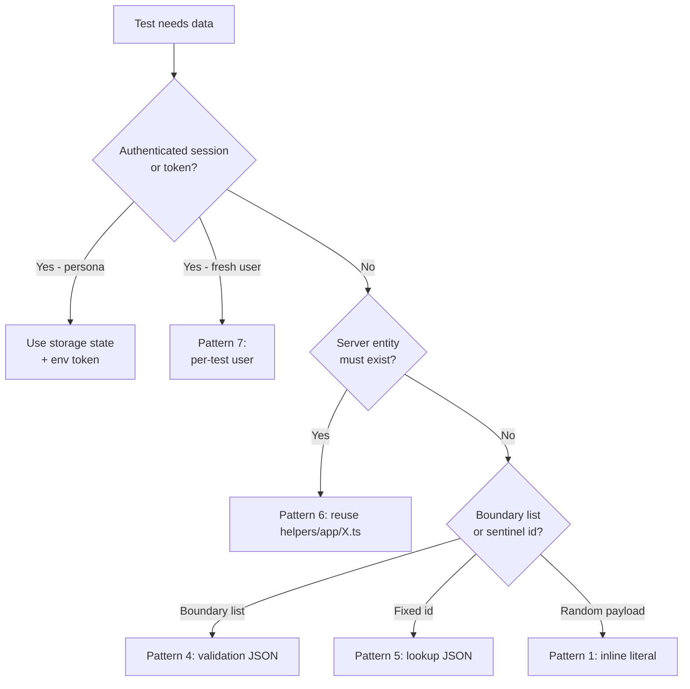

# Authoring patterns

The standardized SKILL.md structure (§0 below) is the **frame** every skill fits into. Within that frame, four body patterns (§1–§4) cover ~95% of the substance. Pick the body patterns that fit each section; the structural frame is non-negotiable.

## Contents

- [0. Standardized SKILL.md structure (the frame — REQUIRED)](#0-standardized-skillmd-structure-the-frame--required)
- [1. Workflow checklist pattern](#1-workflow-checklist-pattern)
- [2. Examples pattern](#2-examples-pattern)
- [3. Conditional decision pattern](#3-conditional-decision-pattern)
- [4. Feedback-loop pattern](#4-feedback-loop-pattern)
- [5. Combining patterns](#5-combining-patterns)

---

## 0. Standardized SKILL.md structure (the frame — REQUIRED)

Every SKILL.md in this repo follows the exact section order below. The frame is mandatory; the body patterns (§1–§4) live *inside* the workflow / decision sections. Skipping a structural section is the #1 reason skills fail review — Tier 1 audits caught dozens of inconsistencies because earlier skills predated this standardization.

The hook ([skill-validate.py](../../hooks/skill-validate.py)) enforces frontmatter + length + signature device. Manual review (via [`checklist.md`](checklist.md) §3) gates on every other section.

### Mandatory section order

| # | Section | Required? | Purpose |
|---|---------|-----------|---------|
| 1 | **Frontmatter** (`name`, `description`, `metadata.category`, optional `disable-model-invocation`) | Yes | Discoverability gate. `description` includes WHAT + WHEN + 3-7 quoted trigger phrases + 2-4 "Do NOT use for X" disclaimers. |
| 2 | **Opener** (1 paragraph) | Yes | What surface this skill covers, who pairs with it, the failure mode it prevents. Names the paired rule (or `(none)`). |
| 3 | **`## Critical`** | Yes | 5–9 hard rules in `**ALWAYS**` / `**NEVER**` form. Drawn from real incidents. The model scans this in 30 seconds. |
| 4 | **`## What's in each file`** | When multi-file | Mini-index table mapping `SKILL.md` / `reference.md` / `templates.md` / `<topic>.md` to purpose. Skip when single-file. Includes the "boundary rule" callout. |
| 5 | **`## Architecture map | Storage location map | Decision tree`** (signature device) | Yes (at least one) | The project signature: table or mermaid. Hook flags missing. |
| 6 | **Workflow / phases / decision tables** | Usually | The skill's substance. Use one or more body patterns from §1–§4. |
| 7 | **`## Anti-patterns`** | Yes | Bulleted ❌ list of mistakes that real authors hit. Each anti-pattern names the fix. |
| 8 | **`## Self-review checklist`** | Yes | Checkboxes the model walks through before declaring the artifact done. |
| 9 | **`## Examples`** | Yes (2–3) | Worked walkthroughs that cite the workflow steps. **REAL codebase names only — no placeholders** (`MyResource`, `<resource>`). |
| 10 | **`## Troubleshooting`** | Yes | Symptom → cause → fix table. Real failure modes a future author will hit. |
| 11 | **`## See Also`** | Yes | Paired rule (or `(none)`), sibling cluster (verified populated, not TBD), orchestration doc, identity, companion plan. **Bidirectional cross-references** — when this section cites a sibling, that sibling's See Also mentions this skill back. |

### Why the frame is non-negotiable

Every Tier 1 audit found drift caused by skills that used a different structure. Models reading skills route by section name; deviations break routing. A skill missing `## Critical` doesn't surface its hard rules in the model's first 30-second scan. A skill with no `## Examples` makes the model extrapolate from abstractions instead of real repo names. A skill without `## Troubleshooting` leaves authors guessing when the workflow fails partway through.

The frame works because **every skill loaded into context can be skimmed the same way**. The model finds what it needs in the same place every time.

### Source of truth

- The **template** ([`assets/SKILL-template.md`](../assets/SKILL-template.md)) encodes this frame as a fill-in-the-blanks starter.
- The **checklist** ([`checklist.md`](checklist.md) §3) gates on each section's presence.
- The **mandate** lives in [`SKILL.md` § Standardized SKILL.md structure](../SKILL.md).

When any of those three files disagree, the SKILL.md mandate wins; fix the template / checklist drift in the same edit.

---

## 1. Workflow checklist pattern

Use when the task is a multi-step procedure where the agent benefits from tracking progress. Reproduces Anthropic's "checklist Claude can copy into its response and check off as it progresses".

**Recipe:**

1. Lead with a fenced-code checklist of N steps.
2. Below the checklist, expand each step under an H3 in imperative mood.
3. Make Step 1 a precondition check ("does this already exist?") to enable early exit.
4. Make the last step verification ("run lints", "confirm visibility").

**Project example — adding a new API spec (extracted from `api-testing/SKILL.md`):**

````markdown
## Authoring a new API spec — workflow

```
- [ ] 1. Confirm method/path lives in config/app.ts under `api`. Add it if missing.
- [ ] 2. Schema: check for an existing one — error/pagination/auth shapes
        are reused across resources. Default to z.strictObject() and
        z.string().uuid() for ids.
- [ ] 3. Helper: only add when the call is reused, multi-step, or sets
        up preconditions. Single happy-path GETs are clearer inline.
- [ ] 4. Body builder buildCreate<X>Body / buildUpdate<X>Body via faker.
        Names always carry a "qa-" prefix.
- [ ] 5. Add SUITES.API_<RESOURCE> to enums/app/qase-suites.ts if missing.
- [ ] 6. Author the spec from templates.md.
- [ ] 7. Cover the negative matrix (400, 401, 403, 404, 405, 409).
- [ ] 8. Wire cleanup in afterEach/afterAll. Synthetics before probes.
- [ ] 9. Run: npx playwright test <spec> --grep "@App-API"; read lints.
```

### Step 1: Confirm the path is in config

Open `config/app.ts`. If the endpoint isn't listed under `appConfig.api.<RESOURCE>`, add it before writing the spec. Specs that hardcode raw paths drift the moment the API changes.

### Step 2: Schema
...
````

**When this pattern wins:** any skill with > 3 sequential steps. `scaffold-spec`, `data-strategy`, `api-testing` all use it.

**When to skip:** if the procedure is < 3 steps or the steps are deeply interdependent (use [§ 3 Conditional](#3-conditional-decision-pattern) instead).

---

## 2. Examples pattern

Use when output quality depends on the agent seeing input/output pairs rather than abstract description.

**Recipe:** present 2-3 input/output pairs with consistent labels. Then state the rule once underneath. The agent extrapolates from examples better than from imperatives alone.

**Project example — locator priority (for a future `page-objects/SKILL.md`):**

````markdown
## Locator priority

Always use the highest-priority locator that uniquely matches the element.

**Example 1 — button with visible label:**

Bad:
```typescript
page.locator('button.submit-btn');
```

Good:
```typescript
page.getByRole('button', { name: 'Submit' });
```

**Example 2 — input identified by label:**

Bad:
```typescript
page.locator('input[name="email"]');
```

Good:
```typescript
page.getByLabel('Email');
```

**Example 3 — element with no semantic role or label:**

Bad:
```typescript
page.locator('div.metric-tile:nth-child(3)');
```

Good:
```typescript
page.getByTestId('synthetic-uptime-tile');
```

**The rule:** prefer `getByRole > getByLabel > getByText > getByTitle > getByTestId`. Never use raw CSS or XPath when one of the semantic locators applies.
````

**When this pattern wins:** stylistic choices, test names, commit messages, file naming, anywhere the *shape* of the output matters.

**When to skip:** if the rule is obvious from the example you're already showing in another section.

---

## 3. Conditional decision pattern

Use when the agent must pick between branches based on the input. Two flavours:

### 3a — inline branches

For 2-3 branches with short bodies:

````markdown
## Spec type routing

1. Determine the spec type:

   **API endpoint test?** → Follow the API workflow below.
   **End-to-end UI flow?** → Follow the E2E workflow below.
   **Form-or-sheet validation?** → Follow the functional workflow below.

2. API workflow:
   - Imports from `fixtures/pom/test-options`
   - Tag with `@App-API`
   - Read [`api-testing` skill](../../api-testing/SKILL.md) before writing.

3. E2E workflow:
   - Imports from `fixtures/pom/test-options`
   - Tag with `@App-E2E`
   - Read [`page-objects`](../../page-objects/SKILL.md) + [`selectors`](../../selectors/SKILL.md) + [`test-standards`](../../test-standards/SKILL.md) before writing.

4. Functional workflow:
   - Same imports as E2E
   - Tag with `@App-regression`.
````

### 3b — mermaid decision tree

For 4+ branches or branches that themselves branch:

````markdown

````

`data-strategy/SKILL.md` uses this exact device.

**When this pattern wins:** any skill with multiple input shapes (test types, monitor types, entity kinds).

**When to skip:** if there are only 2 branches and one is the obvious default — write the default first, then a single "Exception:" callout.

---

## 4. Feedback-loop pattern

Use when output quality is verifiable and the agent benefits from "validate → fix → repeat" rather than one-shot.

**Recipe:**

1. Make change.
2. Run validator immediately.
3. If validator fails, read message, fix, re-run.
4. Only proceed when validator passes.

**Project example — schema validation:**

````markdown
## Adding a Zod schema for a new endpoint

1. Author the schema in `fixtures/api/schemas/app/<resource>.ts` using `z.strictObject()` (rejects extras — catches API regressions early).
2. **Validate immediately**: write a one-line throwaway in the spec under construction:
   ```typescript
   const { status, body } = await apiRequest({ method: 'GET', url: appConfig.api.X });
   expect(status).toBe(200);
   const parsed = MyResponseSchema.parse(body);  // throws on mismatch
   expect(parsed).toBeTruthy();
   ```
3. If `parse` throws:
   - Read the Zod error path (`field 'createdAt' expected string, got null`).
   - Decide: is the schema wrong (loosen it), or is the API wrong (file a bug, then `.nullable()` with a comment citing the bug)?
   - Re-run.
4. **Only commit the spec once `parse` succeeds three times in a row.** Schemas that flake to pass under load mask real drift.
````

**When this pattern wins:** Zod parsing, lint runs, type-check loops, snapshot diffing, anywhere the agent has a deterministic verifier in hand.

**When to skip:** for subjective outputs (writing style, design judgment) — there is no validator to loop against, so don't fake one.

---

## 5. Combining patterns

The populated skills mix these patterns liberally. Typical combinations:

- **Workflow + Conditional** — `scaffold-spec` runs a workflow whose Step 1 is a conditional (API / E2E / functional).
- **Workflow + Feedback loop** — `api-testing` workflow ends with "run lints; if errors, fix and re-run".
- **Conditional + Examples** — `data-strategy` decision tree picks a pattern (Conditional), then each pattern has good/bad examples (Examples).
- **All four** — `data-strategy` SKILL.md + `patterns.md` together: Workflow (decision tree), Conditional (per-pattern branching), Examples (good vs bad in `patterns.md`), Feedback loop (DRY-search before adding helpers).

The patterns are not categories of skill — they are paragraphs you stack inside a skill. A 200-line SKILL.md typically uses 2-3 of them; a richer skill with `references/` will use all four across the whole package.
