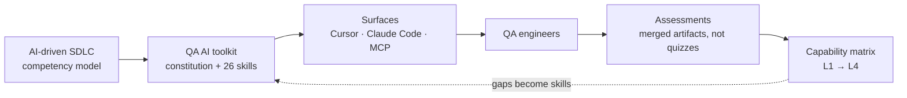

# Governance

This document decides four things: **who may change what**, **what evidence a change owes**, **how the toolkit reaches engineers**, and **which numbers are allowed to mean progress**. Everything else — the rules themselves — lives in `.claude/CLAUDE.md` and the skills it routes to.

It exists because the alternative is already visible in this repository's own history. On the day the eval harness was built, eight separate claims in the README and `BENCHMARK.md` were measurably false: the rule-suite count, the invalid-case count, how many rules fire end to end, a defect count that disagreed with its own table, and a coverage denominator of 28 in a repository shipping 26 skills. None of it was dishonest. All of it was uncontrolled. Documentation drifts at the speed of editing, and nothing was watching.

## The one rule

**Nothing here may claim more than it can show.**

A number in prose is a claim. A number a script recomputes is a fact. Where the two can be connected, they must be — and this document is subject to the same check as the README. Where they cannot, the claim says so in its own sentence.

## The chain this governs

The dotted edge is the part that usually goes missing. A capability matrix that never feeds back into the rules is an HR artifact; the gap a matrix exposes is a specification for the next skill.

## Who decides what

| Role | May | May not |
|---|---|---|
| **Owner** — `@georgikazandzhiev-code` | Merge; cut a version; promote a pattern to `canonical`; change what the gate refuses; grant L1–L4 | Approve their own change to a `## Critical` block without a second reviewer |
| **Reviewer** — any engineer at L3+ | Approve or block; require a re-measure; open a falsification | Merge a rule change alone; promote to `canonical` |
| **Contributor** — anyone | Propose any change; add a skill; add a lint rule; add an eval case | Merge; edit another skill's `## Critical` without its reviewer |
| **Agent** — Claude Code, Cursor | Write patterns at `tier: candidate`; promote `candidate → active` on evidence | Promote anything to `canonical`; edit `CLAUDE.md`; weaken a schema or an assertion to pass |

**Known risk, stated rather than hidden: the owner and the only reviewer are the same person.** Bus factor 1. Until a second person holds merge rights, every rule in this table above the Contributor row is self-enforced, and this document's authority over the owner is exactly zero. The exit condition is in Rollout Phase 1 and it gates widening past one team — not because process demands it, but because a single reviewer cannot catch the class of error this repository has already made twice: a confident, well-argued, wrong number.

## Change classes

The class is decided by **what the change does to output that was previously correct**, not by how many lines it touches.

| Change | Version | Evidence it owes | Gate |
|---|---|---|---|
| Wording, examples, cross-references | `patch` | none | CI green |
| A rule or section added | `minor` | none — but state in the PR why nothing previously correct breaks | CI green + one reviewer |
| **A rule changes meaning or is removed** | `major` | **re-measure the skill** and append to `evals/history.json` | CI green + owner, and the history entry in the same PR |
| A new skill | starts at `1.0.0` | `npm run validate` green + a routing row in `CLAUDE.md § Routed Skill Index` | CI green + owner |
| A new or changed lint rule | plugin `minor` / `major` | a `RuleTester` suite **and** a fault-injection case | CI green + owner |
| Promoting a pattern to `canonical` | n/a | the pattern's counters, its evidence label, and the diff | **PR only, human, never an agent** |
| A number stated in the docs | n/a | either a validator check that recomputes it, or a sentence naming it as unverified | CI green |

A `major` bump with no history entry is the failure this table exists to prevent. The version is what a score is attributed to; a version that no longer describes the file makes the whole history lie, silently and retroactively.

## What CI refuses, and what it cannot

Three jobs run on every push and every pull request (`.github/workflows/validate.yml`).

| Blocking — a merge cannot proceed | Advisory — reported, never blocks |
|---|---|
| `npm run validate` — front matter, required sections, semver, cross-reference integrity, `mcp.json` secrets, README counts vs the filesystem, governance artifacts | `npm run check:bump` — a `SKILL.md` changed while its `version` did not |
| `node tests/rules.test.js` — 21 `RuleTester` suites, 40 invalid-case assertions | Length budget — a `SKILL.md` over 380 lines is a warning |
| `node tests/fault-injection.test.mjs` — every rule must fire on the known-bad tree, stay silent on the compliant tree, and stop reporting when its visitor is emptied | `description` under 120 chars, or missing a "Do NOT use for" disclaimer |
| The known-bad fixture must still be rejected by the ESLint CLI, and the compliant one must still pass clean | Category outside the canonical four |
| `npm run eval:compare` — a recorded score drop beyond the noise floor | A declared version disagreeing with the newest history entry |

`check:bump` is advisory **on purpose**. Failing CI over a forgotten patch bump trains people to bump meaninglessly, and a version people bump to silence a robot carries no information. What it protects against is not a missing bump but a version quietly ceasing to describe its file.

**What no gate here can check**, and therefore what a reviewer owes attention to: whether a selector is the right one (needs the real DOM), whether a coverage plan is complete (needs the contract), whether cleanup actually restores state, whether the author explored before generating, whether a test was ever run. Roughly half the constitution is mechanically checkable. The plugin claims exactly that half and no more — a linter that claims more than it checks is worse than none, because it converts an unchecked rule into a checked-looking one.

## Pattern promotion

The `qe-pattern-memory` store is the only part of the toolkit that changes itself. Its tiers exist so that self-modification cannot become self-authorisation.

| Tier | Enters by | May it gate a decision? |
|---|---|---|
| `candidate` | any session, automatically | No — suggest only |
| `active` | `uses ≥ 2`, `success_rate ≥ 0.80`, evidence `EXECUTED` or `STATIC` — automatic when the counters cross | Yes, with the pattern cited |
| `canonical` | **PR review only, by a human** | Yes — contradicting it requires falsification |
| `retired` | falsified, obsolete, or superseded | Never — read-only history |

Two rules carry the weight:

- **No agent writes `tier: canonical`.** Canonical patterns steer future generation, so unreviewed self-promotion is the mechanism by which one wrong belief becomes framework law.
- **Demotion is immediate and failures are recorded in the same edit.** One failure drops `canonical` to `active`. A store that only counts wins converges on false confidence — the same false-green the constitution forbids in tests, one level up.

A falsified `canonical` pattern is a finding about the framework and gets reported to a human, not filed as bookkeeping.

## Rollout

Phases advance on **measured criteria, never on dates**. Each names what must be true to widen, and what must be true to stop and fix instead.

### Phase 0 — Pilot: one engineer, one repository

**Entry:** the toolkit is installed and `npm run validate` is green on a fresh clone.
**Exit:** the pilot's next merged PR touching tests passes the plugin at `--max-warnings 0`, and the pilot can name unprompted which skill supplied the fixtures-barrel path and the tag whitelist. Transmission of house convention is the thing being measured, so the second half is not a formality.
**Stop:** if the violation count at merge is not lower than the pilot's last three pre-toolkit PRs, fix the skill, not the engineer. A skill that needs explaining has not transmitted anything.

### Phase 1 — One team

**Entry:** Phase 0 exit met, **and a second person holds merge rights.** This is the bus-factor-1 exit condition; it gates widening past one team.
**Exit:** the gate runs as a blocking check in that team's CI on a protected branch; two consecutive weeks with no bypass; at least **five** skills carry a lint-gate eval case, so a claim about "the toolkit" stops being a claim about three tasks.
**Stop:** more than one `--no-verify` or gate-disable in a week. That is evidence the gate is wrong or too slow, and widening a gate people route around multiplies the routing around.

### Phase 2 — The QA organisation

**Entry:** Phase 1 exit met, and at least three people assessed at L3.
**Exit:** every repository in scope runs the gate as blocking; every skill that gates a decision has a machine metric behind it; a new engineer reaches L1 in under a day, measured on the next actual hire rather than estimated.
**Stop:** a recorded eval regression beyond the noise floor that survives one release cycle unfixed. Freeze the rollout until it is closed — a governance layer that tolerates its own regressions is advice.

## Capability matrix

Levels are demonstrated by **a merged artifact**, never by a quiz or a self-assessment. The artifact is the assessment.

| Level | Can | Demonstrated by | Signed off by |
|---|---|---|---|
| **L1 — Uses** | Installs the toolkit; writes tests that pass the gate | One merged PR touching tests with zero constitution violations | Owner or any L3+ |
| **L2 — Applies** | Picks the right skill without being told; plans coverage before writing | An API spec whose status-code comment block matches the contract, with the per-field negative matrix present | Owner or any L3+ |
| **L3 — Extends** | Authors or amends a skill correctly; adds a lint rule | A merged skill change with the correct version class, plus — for a rule change — the `evals/history.json` entry that measured it | Owner |
| **L4 — Governs** | Owns a domain; promotes patterns to `canonical`; decides what the gate refuses | One `canonical` promotion with its falsification path written, and one blocking CI check they added and can defend | Owner |

Two deliberate consequences. **L3 cannot be reached by writing prose** — it requires a measurement, because the skill that reads best is not reliably the skill that transmits best, and this repository has a run where the LLM-graded rubric tied while the machine metric found 17 violations against 0. And **L4 requires having said no**: a person who has never made the gate refuse something has not yet governed anything.

## The metrics that govern

| Allowed — report and act on these | Banned — never a target |
|---|---|
| Constitution violations at merge, per PR | Number of skills |
| Skills with a machine metric, over total | Lines of rules or documentation |
| Recorded score per skill version, with its noise floor | Mutation score as a threshold to reach |
| Gate bypasses per week | "AI adoption %", sessions run, tokens spent |
| Time for a new engineer to reach L1 | Test count, or coverage percentage alone |

Every banned metric has a cheap way to game it that makes the codebase worse. Skill count rewards splitting one good skill into three. Lines of rules rewards verbosity in the artifact whose whole design constraint is brevity. A mutation-score threshold rewards asserting on trivia until the number moves — which is why `mutation-testing` gates on regression against a recorded baseline instead, and refused an arbitrary 80% target in the one eval case where a baseline agent shipped exactly that into CI. Test count and coverage reward tests that execute code without asserting anything, the precise false green two of the sixteen lint rules exist to catch.

Inventory is not achievement. The skill count may be **reported**; it may never be **targeted**.

## Review cadence

| When | What | Who |
|---|---|---|
| Every PR | The template checklist; CI's five blocking checks | Reviewer |
| Monthly | Warning debt — currently 6 skills over the 380-line budget. The number may not grow between reviews | Owner |
| Every major Playwright or ESLint release | Re-run the gate and the fault-injection harness against the new version | Owner |

Out of band, immediately, on any of: a `canonical` pattern falsified; an eval regression beyond the noise floor; a validator or lint-rule false positive found in real use; **or a claim in the documentation found to be untrue.** The last trigger has fired once, on the day this document was written, and it is why the ninth validator check exists.

## What this document cannot enforce

- **Its own ownership table**, while one person holds both roles.
- **That a review happens at all.** `.github/CODEOWNERS` *requests* review; it requires it only behind a protected branch with "Require review from Code Owners" enabled, and that setting is unavailable on a free-plan private repository. Here it routes; it does not gate. The "one reviewer" and "owner" gates in § Change classes are therefore conventions the owner keeps, not checks the platform runs — until Phase 1 puts a second person and a protected branch behind them.
- **That a reviewer actually read the diff.** No mechanism proposed here distinguishes a considered approval from a fast one.
- **The quality of a convention** — only that it is transmitted. The eval measures whether a skill teaches the house style, not whether the house style is right. Those are different questions and only the first is measured.
- **Anything about the 23 skills with no recorded measurement.** They are governed by this document and evidenced by nothing.

## Current state — 2026-08-11

| | |
|---|---|
| Skills | 26 on-demand skills — 12 domain, 6 authoring, 4 running, 4 cross-cutting |
| Measured | 3 of 26 skills have recorded history |
| Lint rules, blocking | **16 ESLint rules**, every one firing on the known-bad tree and silent on the compliant one |
| Validator | 9 checks, 0 errors. 6 skills are over the 380-line budget and carry a warning |
| Reviewers with merge rights | **1** |
| Rollout phase | **0**, not yet exited |

Read the coverage row and the reviewer row together before treating any claim about "the toolkit" as a claim about more than three of its skills.

## See also

- `.claude/CLAUDE.md` — the constitution. When it and this document disagree about a rule, the constitution wins; this document governs process, not engineering.
- [`README.md`](README.md) — what the toolkit is, and every measurement behind it.
- [`BENCHMARK.md`](BENCHMARK.md) — the eval runs in full, including the six defects the harness had in itself.
- [`eslint-plugin-qa-constitution/`](eslint-plugin-qa-constitution/) — the half of the constitution a pipeline can refuse to merge.
