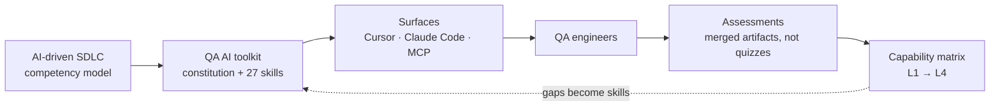

# Governance

This document decides four things: **who may change what**, **what evidence a change owes**, **how the toolkit reaches engineers**, and **which numbers are allowed to mean progress**. Everything else — the rules themselves — lives in `.claude/CLAUDE.md` and the skills it routes to.

It exists because the alternative is already visible in this repository's own history. On the day the eval harness was built, eight separate claims in the README and `BENCHMARK.md` were measurably false: the rule-suite count, the invalid-case count, how many rules fire end to end, a defect count that disagreed with its own table, and a coverage denominator copied from the other repository. None of it was dishonest. All of it was uncontrolled. Documentation drifts at the speed of editing, and nothing was watching.

## The one rule

**Nothing here may claim more than it can show.**

A number in prose is a claim. A number a script recomputes is a fact. Where the two can be connected, they must be — and this document is subject to the same check as the README. Where they cannot, the claim says so in its own sentence.

## The chain this governs

```mermaid
flowchart LR
  A["AI-driven SDLC<br/>competency model"] --> B["QA AI toolkit<br/>constitution + 27 skills"]
  B --> C["Surfaces<br/>Cursor · Claude Code · MCP"]
  C --> D["QA engineers"]
  D --> E["Assessments<br/>merged artifacts, not quizzes"]
  E --> F["Capability matrix<br/>L1 → L4"]
  F -.->|"gaps become skills"| B
```

The dotted edge is the part that usually goes missing. A capability matrix that never feeds back into the rules is an HR artifact; the gap a matrix exposes is a specification for the next skill.

## Who decides what

| Role | May | May not |
|---|---|---|
| **Owner** — `@georgikazandzhiev-code` | Merge; cut a version; promote a pattern to `canonical`; change what the gate refuses; grant L1–L4 | Approve their own change to a `## Critical` block without a second reviewer |
| **Reviewer** — any engineer at L3+ | Approve or block; require a re-measure; open a falsification | Merge a rule change alone; promote to `canonical` |
| **Contributor** — anyone | Propose any change; add a skill; add a lint rule; add an eval case | Merge; edit another skill's `## Critical` without its reviewer |
| **Agent** — Claude Code, Cursor | Write patterns at `tier: candidate`; promote `candidate → active` on evidence | Promote anything to `canonical`; edit `CLAUDE.md`; weaken a schema or an assertion to pass |

**Known risk, stated rather than hidden: the owner and the only reviewer are the same person.** Bus factor 1. Until a second person holds merge rights, every rule in this table above the Contributor row is self-enforced, and this document's authority over the owner is exactly zero. The exit condition is in Rollout Phase 1 and it gates widening past one team — not because process demands it, but because a single reviewer cannot catch the class of error this repository has already made twice: a confident, well-argued, wrong number.

## Change classes

The class is decided by **what the change does to output that was previously correct**, not by how many lines it touches.

| Change | Version | Evidence it owes | Gate |
|---|---|---|---|
| Wording, examples, cross-references | `patch` | none | CI green |
| A rule or section added | `minor` | none — but state in the PR why nothing previously correct breaks | CI green + one reviewer |
| **A rule changes meaning or is removed** | `major` | **re-measure the skill** and append to `evals/history.json` | CI green + owner, and the history entry in the same PR |
| A new skill | starts at `1.0.0` | `npm run validate` green + a routing row in `CLAUDE.md § Routed Skill Index` | CI green + owner |
| A new or changed lint rule | plugin `minor` / `major` | a `RuleTester` suite **and** a fault-injection case | CI green + owner |
| Promoting a pattern to `canonical` | n/a | the pattern's counters, its evidence label, and the diff | **PR only, human, never an agent** — convention, checked by a reviewer against the PR template. Nothing mechanical reads pattern tiers |
| A push to the public mirror | n/a | the pull request template's "Before pushing to the public mirror" checklist is complete: no client or repository-specific name, internal host, ticket key or token | owner |
| A number stated in the docs | n/a | either a validator check that recomputes it, or a sentence naming it as unverified | CI green for the eight claim shapes check 7 recognises; any number in a shape it does not match is a reviewer's job |

A `major` bump with no history entry is the failure this table exists to prevent, and it is only half-caught: where a skill already has history, `validate` warns when the declared version and the newest entry disagree on major.minor; where a skill has none — 24 of 27 — nothing fires at all. The version is what a score is attributed to, and a version that no longer describes its file makes the history lie retroactively, so treat this row as a reviewer's job until every skill is measured.

## One logical change per PR

**SHOULD, not MUST.** A pull request should carry **one logical change**: one fix, one rule, one skill, one tool. As soon as a coherent unit can be shipped on its own, it should get its own PR, branched from `main`, instead of piling up on a long-lived branch. Unrelated changes go into separate PRs even when they were found together.

**Why.** A PR that bundles many parts is hard to review properly: it gets rubber-stamped or it stalls, and one disputed change holds every good one hostage. #4 bundled 41 commits into one PR. Every change in it was right, and it was still far too big to review comfortably. This rule exists because of it.

**Exception: coupled changes.** Related changes that cannot pass CI on their own may ship in one PR. Example from #4: validator check 15 fails on dead links, so the check and the removal of the dead links had to land together. When a PR uses the exception, its description says why the parts can't ship separately.

**There is no line or file limit.** The test is coherence, not size. One mechanical change across many files, such as a rename, is one PR; three small unrelated fixes are three PRs. A number would only invite splitting work into meaningless pieces to stay under it.

**Agents suggest, they don't block.** When planning, they name the PR boundaries before starting (`ai-native-workflow`, Plan phase). When a shippable unit is done, they propose opening its PR. Before pushing, `pr-review` flags a mixed diff and proposes a split. If the author decides to keep the scope, the agent carries on with the work and the review, and the PR description says why.

## Example domain

Every example in the skills uses one invented product: a **scheduled-jobs platform**. A real product's domain in the examples is a map of that product: its services, its endpoints, its failure modes. The invented domain keeps the structure the lessons need, such as typed configurations, agents, slow-arriving data, rules and statuses. It doesn't describe anyone's system.

| Concept | Example domain | Identifiers |
|---|---|---|
| Main resource, with a type that decides its config | **job**, typed `http` / `email` / `export` / `webhook` | `Job`, `jobs`, `JobSchema`, `jobsPage`, `createJobPage`, `listJobs`, `createJob`, `deleteJob` |
| Agent that executes the resource, in a location | **worker**, in a **region** | `Worker`, `workers`, `WorkerSchema`, `workersPage`, `createWorker`, `deleteWorker` |
| Data that arrives minutes after creation | **run stats**, and a run's **steps** | `RunStats`, `runStats`, `RunStep` |
| Event raised by a rule | **notification**, raised by a **notification rule** | `Notification`, `NotificationRule`, `notificationRulesPage` |
| Resource state | **status**: `passing` / `failing` / `degraded` / `paused` | `JobStatus` |
| Service folders and routes | `jobs-service/` (sub-folders `jobs/`, `workers/`, `run-stats/`), `notification-service/`, `tenant-service/`, `shared/`; `/api/v1/jobs`, `/api/v1/workers` | — |
| Internals for distributed-failure cases | a **message queue** with queue streams and a key-value state store, an **event bus**, **executors**, a **scheduler**. The scheduler's work items are *schedule entries*, never *jobs*, and a queue stream is never a bare *stream*, which is a job type. A worker has a `WORKER_ID` that must not be spoofable. Name no real queue or streaming product | `schedules` queue stream, `schedules.dispatch`, `{jobType}` topics, `WORKER_ID` |
| More job types, where a lesson needs more than four | `sftp` (host-only target, port in config), `backup` (port and retention days), `stream` (a `wss://` target) | `buildCreateSFTPJobBody`, `buildCreateBackupJobBody`, `buildCreateStreamJobBody` |
| Type-specific config | `export` `{ recordRunSteps }`, `http` and `stream` `{ verifySsl }`, `sftp` `{ port }`, `email` `{ bodyFormat }`, `backup` `{ port, retentionDays }`, `webhook` `{ description }` | `buildCreateJobBody` (defaults to type `export`) |
| Scheduling and assignment | how often a job runs; the workers assigned to it (nullable) | `runInterval`, `VALID_RUN_INTERVALS`, `workerIds`, `assignments`, `JobAssignmentSchema` |
| Run-stats endpoints and the store behind them | per-job run-stat definitions, a catalog, an expression query and an aggregate query; the store's responses may carry extra fields | `/api/v1/jobs/:id/run-stats`, `/run-stats`, `/run-stats/aggregate`, `RunStatSchema`, `StatsStoreResponseSchema`, `getJobRunStats` |
| Pausing, and a long-lived fixture | pause and resume a job (409 when already paused); a shared fixture that provisions worker → jobs → notification rule → firing notifications | `/api/v1/jobs/:id/pause`, `PauseJobResponseSchema`, `setupFiringNotificationsFixture` |
| More UI page objects | run-stats pages, the notifications list, the create-notification-rule sheet, a per-feature delete dialog, an asset inventory | `RunStatsPage`, `JobRunStatsViewPage`, `NotificationsPage`, `CreateNotificationRulePage`, `DeleteJobDialog`, `InventoryPage` |
| Job status in the UI | a badge per row, four filter cards plus a total, and an **Outcome** column and filter. The **Status** column stays the enabled/disabled toggle, so the two never share a name | `job-status-<jobStatus>`, `filter-passing` / `-degraded` / `-failing` / `-paused` / `filter-total`, `outcome-filter`, `jobStatusCard(jobStatus)`, `getJobStatusBadge`, `getAllJobStatusCounts` |
| A job's expanded view | run-stat cards, a run-steps timeline, tabs **Run Stats** / **Run Steps** / **Timeline**, and an empty state before the first run | `<type>-expanded-view`, `run-stat-card`, `runStepsTimelineView`, `Messages.NO_EXPORT_RUN_STATS` |
| Workers in the UI | worker states Online / Offline / Provisioning, a register-worker sheet, a deploy-config download, a worker picker in the create-job form; routes `/jobs` and `/settings/workers` | `page-workers`, `register-worker-sheet`, `worker-actions-{id}`, `worker-selection`, `nav-link-jobs`, `navigateToWorkers` |
| Navigation in the UI | sidebar, header and settings links to every list page | `navigateToJobs`, `navigateToWorkers`, `navigateToRunStats`, `navigateToNotifications`, `navigateToNotificationRules` |
| Dashboard and URL-synced filters | dashboard sections for notifications, jobs, workers and job types; list filters that sync to the URL | `jobsSection`, `workersSection`, `notificationsSection`, `jobTypesSection`; `OUTCOME_FILTER_LABELS` (`?jobStatus=`), `WORKERS_STATUS_FILTER_LABELS` (`?status=`) |
| Qase suite keys | one suite per resource and test type | `SUITES.APP_JOBS`, `SUITES.API_JOBS`, `SUITES.API_WORKERS` |
| Spec file names | one spec per job type, operation and view | `<type>-job-crud.spec.ts`, `<type>-create-edit-job.spec.ts`, `<type>-job-detail-view.spec.ts`, `export-job-view.spec.ts`, `jobs-page.spec.ts`, `workers-page.spec.ts`, `run-stats-page.spec.ts` |
| Words the domain shares with the test runner | a parallel test process is always a **Playwright worker**, and a bare *worker* is the domain worker. A test execution is always a **test run**, and a bare *run* is a job's run | — |
| Typed data factories and named scenarios | a worker factory (name, location, region) and a job factory; named scenarios such as a worker in a region, a matched worker and job, a disabled job | `WorkerData`, `JobData`, `createWorkerData`, `createJobData`, `createWorkerForRegion`, `createMatchedWorkerAndJobPair`, `disabledJob` |
| Seeders | seed one worker and tear it down; per-type job seeders; a worker plus one job in one call; cleanup of a job that the UI created and whose id the test doesn't know | `setupTestWorker`, `teardownTestWorker`, `setupJob`, `teardownJob`, `setupHttpJob`, `setupSftpJob`, `setupWorkerAndJob` → `{ workerId, jobId }`, `cleanupUiCreatedJobs` |
| A job type that doesn't exist yet | used only in "how to add a new type" examples, so it is never mistaken for a supported one | `graphql`, `buildCreateGraphQLJobBody` |
| Per-test seeding and teardown order | a fixture that seeds one worker per test, as opposed to `seededWorkerId`, which is shared by a whole spec; a seed helper that returns its own cleanup; jobs are deleted before workers | `seededWorker` (`fixtures/api/seeded-worker-fixture.ts`), `seedJob(apiRequest, token)` → `{ jobId, cleanup }`, `cleanupWorkers`, `cleanupWorkersAndJobs` |
| Test-data files | sentinels, lookups and boundary matrices per resource | `test-data/app/worker.json`, `workers.json`, `job-common.json`, `<type>-job.json`, `run-stats.json`, `notifications.json`, `notification-rule.json` |
| Job types and the create flow in the UI | labels Export / HTTP / SFTP / Email / Backup / Stream / Webhook; texts **Create Job**, **Edit Job**, **Delete Job**, `Job "<name>" created successfully`. A UI method that creates through the sheet ends in `FromSheet`, so it never shares a name with the API helper | `job-type-grid`, `job-type-card`, `create-job-button`, `create-job-sheet`, `createJobFromSheet(data: JobFormData)` |

These are generic and stay as they are: **tenant**, **user**, roles, and named public tools (Keycloak, Mailpit, Radix, Qase, k6).

When a lesson depends on a detail the table doesn't cover, invent it inside this domain and add a row here in the same PR. Don't borrow it from a real product. The rewrite lands one skill per PR. Until every skill is done, an identifier can appear in both its old and its new form.

## What CI refuses, and what it cannot

Three jobs run on every push and every pull request (`.github/workflows/validate.yml`).

**The three jobs are required status checks on `main`**, enforced for everyone including administrators (GitHub's public API, checked 2026-10-01), so a red run blocks the merge. Whether code-owner review is also required is visible only to administrators; see § What this document cannot enforce.

| Fails the CI run | Reported, never fails the run |
|---|---|
| `npm run validate` — front matter, required sections, semver, cross-reference integrity, `mcp.json` secrets, README counts vs the filesystem, governance artifacts | `npm run check:bump` — a `SKILL.md` changed while its `version` did not |
| `node tests/rules.test.js` — 23 `RuleTester` suites, 52 invalid-case assertions | Length budget — a `SKILL.md` over 380 lines is a warning |
| `node tests/fault-injection.test.mjs` — every rule must fire on the known-bad tree, stay silent on the compliant tree, and stop reporting when its visitor is emptied | `description` under 120 chars, or missing a "Do NOT use for" disclaimer |
| The known-bad fixture must still be rejected by the ESLint CLI, and the compliant one must still pass clean | Category outside the canonical four |
| `npm run eval:compare` — a recorded score drop beyond the noise floor | A declared version disagreeing with the newest history entry |

`check:bump` is advisory **on purpose**. Failing CI over a forgotten patch bump trains people to bump meaninglessly, and a version people bump to silence a robot carries no information. What it protects against is not a missing bump but a version quietly ceasing to describe its file.

**What no gate here can check**, and therefore what a reviewer owes attention to: whether a selector is the right one (needs the real DOM), whether a coverage plan is complete (needs the contract), whether cleanup actually restores state, whether the author explored before generating, whether a test was ever run. Roughly half the constitution is mechanically checkable. The plugin claims exactly that half and no more — a linter that claims more than it checks is worse than none, because it converts an unchecked rule into a checked-looking one.

## Pattern promotion

The `qe-pattern-memory` store is the only part of the toolkit that changes itself. Its tiers exist so that self-modification cannot become self-authorisation.

| Tier | Enters by | May it gate a decision? |
|---|---|---|
| `candidate` | any session, automatically | No — suggest only |
| `active` | `uses ≥ 2`, `success_rate ≥ 0.80`, evidence `EXECUTED` or `STATIC` — automatic when the counters cross | Yes, with the pattern cited |
| `canonical` | **PR review only, by a human** | Yes — contradicting it requires falsification |
| `retired` | falsified, obsolete, or superseded | Never — read-only history |

Two rules carry the weight:

- **No agent writes `tier: canonical`.** Canonical patterns steer future generation, so unreviewed self-promotion is the mechanism by which one wrong belief becomes framework law.
- **Demotion is immediate and failures are recorded in the same edit.** One failure drops `canonical` to `active`. A store that only counts wins converges on false confidence — the same false-green the constitution forbids in tests, one level up.

A falsified `canonical` pattern is a finding about the framework and gets reported to a human, not filed as bookkeeping.

## Rollout

Phases advance on **measured criteria, never on dates**. Each names what must be true to widen, and what must be true to stop and fix instead.

### Phase 0 — Pilot: one engineer, one repository

**Entry:** the toolkit is installed and `npm run validate` is green on a fresh clone.
**Exit:** the pilot's next merged PR touching tests passes the plugin at `--max-warnings 0`, and the pilot can name unprompted which skill supplied the fixtures-barrel path and the tag whitelist. Transmission of house convention is the thing being measured, so the second half is not a formality.
**Stop:** if the violation count at merge is not lower than the pilot's last three pre-toolkit PRs, fix the skill, not the engineer. A skill that needs explaining has not transmitted anything.

### Phase 1 — One team

**Entry:** Phase 0 exit met, **and a second person holds merge rights.** This is the bus-factor-1 exit condition; it gates widening past one team.
**Exit:** the gate runs as a blocking check in that team's CI on a protected branch; two consecutive weeks with no bypass; at least **five** skills carry a lint-gate eval case, so a claim about "the toolkit" stops being a claim about three tasks.
**Stop:** any `--no-verify` or gate-disable. The constitution lists bypassing hooks under "forbidden, refuse even if asked", so there is no budget of one — a single bypass is either a constitution violation or evidence the gate is wrong, and both stop the widening until answered.

### Phase 2 — The QA organisation

**Entry:** Phase 1 exit met, and at least three people assessed at L3.
**Exit:** every repository in scope runs the gate as blocking; every skill that gates a decision has a machine metric behind it; a new engineer reaches L1 in under a day, measured on the next actual hire rather than estimated.
**Stop:** a recorded eval regression beyond the noise floor that survives one release cycle unfixed. Freeze the rollout until it is closed — a governance layer that tolerates its own regressions is advice.

## Capability matrix

Levels are demonstrated by **a merged artifact**, never by a quiz or a self-assessment. The artifact is the assessment.

**Nothing records who holds which level.** There is no ledger, no check, no warning — which also leaves § Who decides what's "any engineer at L3+" and Phase 2's "three people assessed at L3" resting on a level stored nowhere. The first grant should create a `LEVELS.md` with one row per person, level, the PR that demonstrated it, and who signed; until it exists the column below is an intention.

| Level | Can | Demonstrated by | Signed off by |
|---|---|---|---|
| **L1 — Uses** | Installs the toolkit; writes tests that pass the gate | One merged PR touching tests with zero constitution violations | Owner or any L3+ |
| **L2 — Applies** | Picks the right skill without being told; plans coverage before writing | An API spec whose status-code comment block matches the contract, with the per-field negative matrix present | Owner or any L3+ |
| **L3 — Extends** | Authors or amends a skill correctly; adds a lint rule | A merged skill change with the correct version class, plus — for a rule change — the `evals/history.json` entry that measured it | Owner |
| **L4 — Governs** | Owns a domain; promotes patterns to `canonical`; decides what the gate refuses | One `canonical` promotion with its falsification path written, and one blocking CI check they added and can defend | Owner |

Two deliberate consequences. **L3 cannot be reached by writing prose** — it requires a measurement, because the skill that reads best is not reliably the skill that transmits best, and this repository has a run where the LLM-graded rubric tied while the machine metric found 17 violations against 0. And **L4 requires having said no**: a person who has never made the gate refuse something has not yet governed anything.

## The metrics that govern

| Allowed — report and act on these | Banned — never a target |
|---|---|
| Constitution violations at merge, per PR | Number of skills |
| Skills with a machine metric, over total | Lines of rules or documentation |
| Recorded score per skill version, with its noise floor | Mutation score as a threshold to reach |
| Gate bypasses per week | "AI adoption %", sessions run, tokens spent |
| Time for a new engineer to reach L1 | Test count, or coverage percentage alone |

Every banned metric has a cheap way to game it that makes the codebase worse. Skill count rewards splitting one good skill into three. Lines of rules rewards verbosity in the artifact whose whole design constraint is brevity. A mutation-score threshold rewards asserting on trivia until the number moves — which is why `mutation-testing` gates on regression against a recorded baseline instead, and refused an arbitrary 80% target in the one eval case where a baseline agent shipped exactly that into CI. Test count and coverage reward tests that execute code without asserting anything, the precise false green two of the seventeen lint rules exist to catch.

Inventory is not achievement. The skill count may be **reported**; it may never be **targeted**.

## Review cadence

| When | What | Who |
|---|---|---|
| Every PR | The template checklist; CI's three required jobs | Reviewer |
| Monthly, by hand — nothing schedules it | Warning debt: 6 skills are over the 380-line budget. The count is recomputed by check 7, so the number in this document cannot drift; what is unenforced is the ceiling itself | Owner |
| Every major Playwright or ESLint release — by hand, and nothing watches for the release | Re-run the gate and the fault-injection harness against the new version. The pinned ranges mean CI will never see a new major on its own | Owner |

Out of band, immediately, on any of: a `canonical` pattern falsified; an eval regression beyond the noise floor; a validator or lint-rule false positive found in real use; **or a claim in the documentation found to be untrue.** The last trigger has fired once, on the day this document was written, and it is why the seventh validator check exists.

## What this document cannot enforce

- **Its own ownership table**, while one person holds both roles.
- **That a review happens at all.** `.github/CODEOWNERS` *requests* review; it requires it only behind a protected branch with "Require review from Code Owners" enabled. This repository is public, so that setting is available. As of 2026-10-01 GitHub's public API (`GET /repos/{owner}/{repo}/branches/main`) shows `main` protected, with the three CI jobs (Toolkit structure, Lint plugin rules, Skill eval regression) required for everyone, administrators included, so a red pipeline does block a merge. Whether code-owner review is also required is visible only to administrators. Until that is confirmed, treat the "one reviewer" and "owner" gates in § Change classes as conventions the owner keeps, not checks the platform runs.
- **That a reviewer actually read the diff.** No mechanism proposed here distinguishes a considered approval from a fast one.
- **The quality of a convention** — only that it is transmitted. The eval measures whether a skill teaches the house style, not whether the house style is right. Those are different questions and only the first is measured.
- **Anything about the 24 skills with no recorded measurement.** They are governed by this document and evidenced by nothing.

## Current state — 2026-08-11

| | |
|---|---|
| Skills | 27 on-demand skills — 13 domain, 6 authoring, 4 running, 4 cross-cutting |
| Measured | 3 of 27 skills have recorded history |
| Lint rules, blocking | **17 ESLint rules**, every one firing on the known-bad tree and silent on the compliant one |
| Validator | 15 checks, 0 errors. 6 skills are over the 380-line budget and carry a warning |
| Reviewers with merge rights | **1** |
| Rollout phase | **0**, not yet exited |

Read the coverage row and the reviewer row together before treating any claim about "the toolkit" as a claim about more than three of its skills.

## See also

- `.claude/CLAUDE.md` — the constitution. When it and this document disagree about a rule, the constitution wins; this document governs process, not engineering.
- [`README.md`](README.md) — what the toolkit is, and every measurement behind it.
- [`BENCHMARK.md`](BENCHMARK.md) — the eval runs in full, including the six defects the harness had in itself.
- [`eslint-plugin-qa-constitution/`](eslint-plugin-qa-constitution/) — the half of the constitution a pipeline can refuse to merge.
